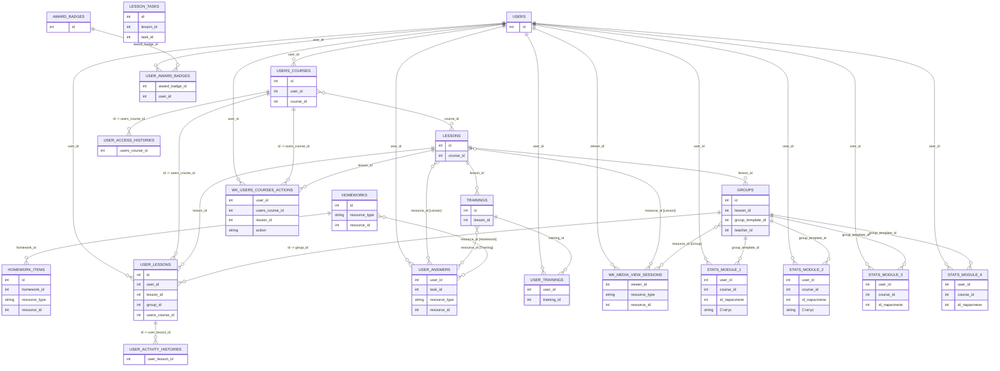

# Данные и ER-диаграмма: текущая поставка

## Источники

Описание ниже опирается на:

- текущие CSV из `hackathon/src`;
- текстовую документацию: `Хакатон_Цифриум_пояснения_по_датасету_Кейс_ML.md`;
- текстовую документацию по таргету: `target_Критерии_перевода.md`.

Важно:

- первый безымянный столбец в CSV выглядит как технический индекс выгрузки;
- во многих ID значения записаны с разделителями тысяч, например `1,106,681`;
- в нескольких ключевых таблицах есть явные `id` и `resource_id`, поэтому большая часть основных связей проверяется напрямую.

## Коротко

Текущая поставка состоит из трёх слоёв:

- сырые LMS-логи и справочники: `users`, `users_courses`, `lessons`, `user_lessons`, `user_answers`, `user_trainings`, `wk_users_courses_actions`, `wk_media_view_sessions`, `groups`, `trainings`, `lesson_tasks`, `homeworks`, `homework_items`, `user_access_histories`, `user_activity_histories`, `award_badges`, `user_award_badges`;
- сводные таблицы для модулей: `stats__module_1` ... `stats__module_4`;
- документация по критериям перевода между модулями.

Для таргета по документации особенно важны:

- `wk_media_view_sessions`;
- `groups`;
- `lessons`;
- `lesson_tasks`;
- `trainings`;
- `user_trainings`;
- `homeworks`;
- `homework_items`;
- `users_courses`;
- `user_answers`.

Сводные `stats__module_*` тоже важны:

- `stats__module_1` и `stats__module_2` содержат готовый столбец `Статус` со значениями `Завершил`, `Отчислен`;
- `stats__module_3` и `stats__module_4` не содержат `Статус`.

## Состав файлов

| Файл | Строк | Гранулярность | Главные ID / ключи | Содержание |
|---|---:|---|---|---|
| `users.csv` | 95,395 | пользователь | `id` | профиль пользователя |
| `users_courses.csv` | 290,835 | пользователь на курсе | `id`, `user_id`, `course_id` | состояние курса, доступ, баллы |
| `lessons.csv` | 3,369 | урок | `id`, `course_id` | структура уроков курса |
| `groups.csv` | 13,076 | вебинар / показ урока | `id`, `lesson_id`, `group_template_id` | онлайн-вебинары и фактическое время проведения |
| `trainings.csv` | 410 | тренинг | `id`, `lesson_id` | метаданные тренингов |
| `lesson_tasks.csv` | 29,544 | задача в уроке | `id`, `lesson_id`, `task_id` | задачи, их порядок и обязательность |
| `homeworks.csv` | 1,226 | домашнее задание | `id`, `resource_type`, `resource_id` | ДЗ, собранные по урокам / материалам / событиям |
| `homework_items.csv` | 5,901 | элемент ДЗ | `id`, `homework_id`, `resource_type`, `resource_id` | отдельные требования внутри ДЗ |
| `user_access_histories.csv` | 667,124 | история доступа пользователя к курсу | `users_course_id` | интервалы доступа к курсу |
| `user_lessons.csv` | 3,070,664 | пользователь на уроке | `id`, `user_id`, `lesson_id`, `users_course_id`, `group_id` | посещение, просмотры и прогресс по урокам |
| `user_activity_histories.csv` | 3,031,137 | действие в LMS | `user_lesson_id` | история действий внутри урока |
| `user_answers.csv` | 15,176,182 | ответ пользователя | `user_id`, `task_id`, `resource_type`, `resource_id` | ответы по задачам |
| `user_trainings.csv` | 427,628 | пользователь на тренинге | `user_id`, `training_id` | прохождение тренингов и оценки |
| `wk_users_courses_actions.csv` | 12,909,207 | событие на курсе | `user_id`, `users_course_id`, `lesson_id`, `action` | event-log действий на курсе |
| `wk_media_view_sessions.csv` | 852,358 | сессия просмотра медиа | `viewer_id`, `resource_type`, `resource_id` | просмотры записей и вебинаров |
| `award_badges.csv` | 6 | тип награды | `id` | справочник наград |
| `user_award_badges.csv` | 252,843 | выданная награда | `award_badge_id`, `user_id` | выданные пользователям награды |
| `stats__module_1.csv` | 3,261 | пользователь в модуле 1 | `user_id`, `course_id`, `id параллели` | сводка критериев + `Статус` |
| `stats__module_2.csv` | 1,955 | пользователь в модуле 2 | `user_id`, `course_id`, `id параллели` | сводка критериев + `Статус` |
| `stats__module_3.csv` | 1,785 | пользователь в модуле 3 | `user_id`, `course_id`, `id параллели` | сводка критериев без `Статус` |
| `stats__module_4.csv` | 1,707 | пользователь в модуле 4 | `user_id`, `course_id`, `id параллели` | сводка критериев без `Статус` |

## Таблицы, которые уже можно использовать для target

По документации критерии перевода опираются на такие условия:

1. минимум один вебинар посещён онлайн;
2. просмотрено 80% занятий и 80% контента;
3. решены все обязательные задачи;
4. пройден текущий контроль;
5. пройдена рефлексия;
6. пройдена промежуточная аттестация (`>= 8` баллов).

С текущей поставкой это лучше всего раскладывается так:

- вебинары и просмотры: `groups`, `wk_media_view_sessions`, частично `user_lessons`, `wk_users_courses_actions`;
- задачи и обязательный минимум: `lesson_tasks`, `user_answers`, частично `homeworks`, `homework_items`;
- тренинги и оценки: `trainings`, `user_trainings`;
- курс, доступ и накопленные баллы: `users_courses`, `user_access_histories`, `user_lessons`, `wk_users_courses_actions`;
- готовые target-like метки по модулям: `stats__module_1`, `stats__module_2`.

## Подтверждённые связи

Ниже перечислены связи, которые подтверждаются и документацией, и текущими CSV.

- `users.id -> users_courses.user_id` — `100%` покрытие уникальных `user_id` из `users_courses`.
- `users.id -> user_answers.user_id` — `100%`.
- `users.id -> user_trainings.user_id` — `100%`.
- `users.id -> wk_media_view_sessions.viewer_id` — `100%`.
- `users.id -> user_lessons.user_id` — `99.96%`.
- `users.id -> wk_users_courses_actions.user_id` — `99.96%`.
- `users.id -> user_award_badges.user_id` — `97.45%`.

- `users_courses.id -> user_access_histories.users_course_id` — `99.99%`.
- `users_courses.id -> user_lessons.users_course_id` — `99.98%`.
- `users_courses.id -> wk_users_courses_actions.users_course_id` — `99.98%`.

- `users_courses.course_id -> lessons.course_id` — `99` курсов из `137` course_id в `lessons`; в `users_courses` всего `99` уникальных `course_id`.

- `lessons.id -> user_lessons.lesson_id` — `98.24%`.
- `lessons.id -> wk_users_courses_actions.lesson_id` — `100%` для непустых `lesson_id`.
- `lessons.id -> groups.lesson_id` — `99.76%`.
- `lessons.id -> trainings.lesson_id` — `98.44%`.

- `groups.id -> user_lessons.group_id` — `99.71%`.
- `user_lessons.id -> user_activity_histories.user_lesson_id` — `99.18%`.

- `user_answers.resource_id[Lesson] -> lessons.id` — `98.1%`.
- `user_answers.resource_id[Training] -> trainings.id` — `100%`.
- `user_answers.resource_id[Homework] -> homeworks.id` — `100%`.

- `wk_media_view_sessions.resource_id[Lesson] -> lessons.id` — `100%`.
- `wk_media_view_sessions.resource_id[Group] -> groups.id` — `100%`.

- `user_award_badges.award_badge_id -> award_badges.id` — `100%`.

- `homework_items.homework_id -> homeworks.id` — `100%`.

- `stats__module_1.user_id -> users.id` — `100%`.
- `stats__module_2.user_id -> users.id` — `100%`.
- `stats__module_3.user_id -> users.id` — `100%`.
- `stats__module_4.user_id -> users.id` — `100%`.

- `stats__module_1.course_id -> users_courses.course_id` — `100%`.
- `stats__module_2.course_id -> users_courses.course_id` — `100%`.
- `stats__module_3.course_id -> users_courses.course_id` — `100%`.
- `stats__module_4.course_id -> users_courses.course_id` — `100%`.

- `stats__module_*.id параллели -> groups.group_template_id` — `100%` для всех четырёх модулей.

## Неполные или проблемные связи

Это текущие места, где документация и данные не замыкаются до конца.

- `user_lessons.id -> user_activity_histories.user_lesson_id` покрывается на `99.18%` уникальных `user_lesson_id` из `user_activity_histories`. Связь теперь есть и в целом рабочая, но не полная: `20,872` ID из `user_activity_histories` не находятся в текущем `user_lessons.csv`, а `545,217` ID из `user_lessons.csv` не имеют событий в `user_activity_histories`.

- `lesson_tasks.lesson_id -> lessons.id` покрывается только на `57%` уникальных `lesson_id`. Значит, `lesson_tasks` описывает более широкий набор уроков, чем текущий `lessons.csv`, или же `lessons.csv` выгружен не полностью относительно задач.

- `lesson_tasks.task_id -> user_answers.task_id` покрывается только на `37.72%` уникальных `task_id` из `lesson_tasks`. Следовательно, в `user_answers` и `lesson_tasks` живут не полностью совпадающие подмножества задач.

- `homeworks.resource_id[Lesson] -> lessons.id` покрывается только на `27.51%`. По документации это должен быть ID урока, но в текущей поставке большая часть этих ID не находится в `lessons.csv`.

- В `homeworks.csv` есть `resource_type = LessonMaterial`, но отдельной таблицы материалов уроков в поставке нет.

- В `homeworks.csv` есть одна строка с `resource_type = Event`, но её `resource_id` не матчится с `groups.id`.

- `homework_items.resource_id[Task] -> lesson_tasks.task_id` покрывается только на `23.33%`. Значит, `homework_items` ссылается на более широкий мир задач, чем текущий `lesson_tasks.csv`.

- В `homework_items.csv` есть `resource_type = CommonFile` и `Video`, но таблиц для этих сущностей в поставке нет.

- `user_lessons.group_id` матчится с `groups.id` на `99.71%`, а с `groups.group_template_id` — на `0%`. Значит, в новом датасете это почти наверняка ID конкретной группы / вебинара, а не `group_template_id` и не “id параллели”.

- `groups.teacher_id` не матчится с `users.id` (`0%`), хотя `stats__module_*.teacher_id` матчится с `users.id` на `100%`. Значит, `teacher_id` в `groups` и `teacher_id` в `stats__module_*` живут в разных пространствах идентификаторов.

- `wk_users_courses_actions.sourceable_id` почти не помогает для связности: оно заполнено только у `visit_preparation_material`, а для `start_training`, `user_answer`, `visit_video`, `visit_translation` пусто.

## Что это значит для таргета

С текущей поставкой target можно строить заметно полнее, потому что в данных есть:

- явный `users_courses.id`;
- явный `lessons.id`;
- `resource_id` в `user_answers`;
- `resource_id` в `wk_media_view_sessions`;
- явный `award_badges.id`;
- `trainings.csv`;
- `groups.csv`, `lesson_tasks.csv`, `homeworks.csv`, `homework_items.csv`;
- `stats__module_1/2` с готовым `Статус`.

Но для полностью “честного” raw target всё ещё мешают:

- неполная связность вокруг `lesson_tasks`, `homeworks`, `homework_items`;
- несогласованные teacher IDs и разные уровни group-идентификаторов (`groups.id` против `groups.group_template_id`) в части таблиц.

Практически это означает:

- `stats__module_1` и `stats__module_2` уже можно использовать как source of truth для target по первым двум модулям;
- raw LMS target по критериям перевода можно собирать лучше ещё и потому, что `user_activity_histories` теперь стыкуется с `user_lessons` по явному `id`;
- при этом не для всех критериев и не по всем таблицам получится обойтись без оговорок из-за неполных связей по задачам, ДЗ и template-level группам.

## Краткие описания таблиц
### `users.csv`
Профили пользователей LMS.
| Колонка | Описание | Возможные значения | Диапазон дат-времени |
|---|---|---|---|
| `Unnamed: 0` | Технический индекс строки выгрузки. | — | — |
| `id` | Явный идентификатор записи. | — | — |
| `last_explainer_seen_→_course` | Техническое служебное поле профиля. | — | — |
| `created_at` | Время создания записи. | — | 2025-01-31 14:16:00 — 2026-03-27 16:13:00 |
| `updated_at` | Время последнего обновления записи. | — | 2025-05-01 02:24:00 — 2025-05-31 20:35:00 |
| `type` | Тип пользователя или тренинга. | User::Pupil, User::Agent | — |
| `remember_created_at` | Время создания remember-токена. | — | 2025-01-31 14:16:00 — 2026-03-27 16:44:00 |
| `sign_in_count` | Количество входов пользователя. | — | — |
| `current_sign_in_at` | Время текущего входа. | — | 2025-05-01 02:24:00 — 2025-05-31 21:45:00 |
| `last_sign_in_at` | Время предыдущего входа. | — | 2025-02-17 06:46:00 — 2026-03-27 16:47:00 |
| `grade_id` | ID класса / параллели пользователя. | — | — |
| `subscribed` | Подписан ли пользователь. | True, False | — |
| `grade_checked` | Проверен ли класс пользователя. | True, False | — |
| `is_teacher` | Флаг преподавателя. | True, False | — |
| `timezone` | Часовой пояс пользователя. | — | — |
| `grade_changed_at` | Время изменения класса пользователя. | — | 2025-02-04 15:51:00 — 2026-03-26 14:58:00 |
| `xp` | Количество XP пользователя. | — | — |
| `d_wk_school_id` | ID школы. | — | — |
| `d_wk_municipal_id` | ID муниципалитета. | — | — |
| `d_wk_region_id` | ID региона. | — | — |
| `d_updated_at` | Техническое время обновления записи в DWH. | — | 2025-05-01 02:05:00 — 2025-05-31 19:43:00 |
| `wk_gender` | Код пола пользователя. | 1, 2 | — |

### `users_courses.csv`
Основа уровня `user-course`: запись пользователя на курс и состояние прохождения.
| Колонка | Описание | Возможные значения | Диапазон дат-времени |
|---|---|---|---|
| `Unnamed: 0` | Технический индекс строки выгрузки. | — | — |
| `id` | Явный идентификатор записи. | — | — |
| `user_id` | ID пользователя из `users.id`. | — | — |
| `course_id` | ID курса. | — | — |
| `state` | Статус сущности или прохождения. | active, inactive | — |
| `created_at` | Время создания записи. | — | 2025-02-07 11:33:00 — 2026-03-26 20:23:00 |
| `updated_at` | Время последнего обновления записи. | — | 2025-02-19 07:00:00 — 2026-03-27 01:49:00 |
| `access_finished_at` | Дата окончания доступа к курсу. | — | 2025-02-16 00:00:00 — 2026-09-26 00:00:00 |
| `wk_points` | Баллы пользователя внутри курса или урока. | — | — |
| `wk_max_points` | Максимум баллов по курсу или уроку. | — | — |
| `wk_max_viewable_lessons` | Максимум уроков, доступных пользователю на курсе. | — | — |
| `wk_max_task_count` | Максимум задач, доступных пользователю на курсе. | — | — |
| `wk_officially_started_at` | Дата официального старта прохождения курса. | — | 2023-06-21 00:00:00 — 2026-02-23 00:00:00 |
| `wk_course_completed_at` | Время завершения курса пользователем. | — | 2026-01-12 14:35:00 — 2026-03-26 17:26:00 |

### `lessons.csv`
Справочник уроков курсов.
| Колонка | Описание | Возможные значения | Диапазон дат-времени |
|---|---|---|---|
| `Unnamed: 0` | Технический индекс строки выгрузки. | — | — |
| `id` | Явный идентификатор записи. | — | — |
| `course_id` | ID курса. | — | — |
| `conspect_expected` | Есть ли у урока конспект. | True, False | — |
| `task_expected` | Есть ли у урока проверочные задания. | True, False | — |
| `lesson_number` | Порядковый номер урока в курсе. | — | — |
| `wk_max_points` | Максимум баллов по курсу или уроку. | — | — |
| `wk_task_count` | Количество задач в уроке. | — | — |
| `wk_survival_training_expected` | Есть ли у урока тренажёр "выживальщик". | True, False | — |
| `wk_scratch_playground_enabled` | Включена ли интеграция Scratch. | True, False | — |
| `wk_attendance_tracking_enabled` | Включён ли трекинг посещения урока. | True, False | — |
| `wk_video_duration` | Длительность видео урока. | — | — |
| `wk_attendance_tracking_disabled_at` | Время отключения трекинга посещения. | — | 2025-12-23 22:25:00 — 2026-01-19 11:05:00 |

### `groups.csv`
Онлайн-вебинары и показы уроков.
| Колонка | Описание | Возможные значения | Диапазон дат-времени |
|---|---|---|---|
| `Unnamed: 0` | Технический индекс строки выгрузки. | — | — |
| `id` | Явный идентификатор записи. | — | — |
| `lesson_id` | ID урока из `lessons`. | — | — |
| `teacher_id` | ID преподавателя. | — | — |
| `starts_at` | Плановое время начала вебинара. | — | 2025-01-08 07:00:00 — 2027-12-27 05:00:00 |
| `duration` | Плановая длительность вебинара в минутах. | — | — |
| `state` | Статус сущности или прохождения. | finished, created | — |
| `group_template_id` | ID параллели / шаблона группы. | — | — |
| `video_available` | Доступна ли запись вебинара. | True, False | — |
| `pupils_notified_at` | Время уведомления учеников о вебинаре. | — | 2025-03-05 11:50:00 — 2026-04-07 15:00:00 |
| `wk_actual_started_at` | Фактическое время начала вебинара. | — | 2025-03-07 13:42:00 — 2026-04-07 15:01:00 |
| `wk_actual_finished_at` | Фактическое время окончания вебинара. | — | 2025-03-10 08:10:00 — 2026-04-07 15:58:00 |
| `wk_duration_actual` | Фактическая длительность вебинара. | — | — |

### `trainings.csv`
Справочник тренингов.
| Колонка | Описание | Возможные значения | Диапазон дат-времени |
|---|---|---|---|
| `Unnamed: 0` | Технический индекс строки выгрузки. | — | — |
| `id` | Явный идентификатор записи. | — | — |
| `name` | Системное название сущности. | — | — |
| `discipline_id` | ID дисциплины тренинга. | — | — |
| `time_limit` | Лимит времени на тренинг. | — | — |
| `published_at` | Время публикации тренинга. | — | 2023-09-22 08:48:00 — 2026-04-06 09:07:00 |
| `difficulty` | Уровень сложности тренинга. | 3, 5 | — |
| `lesson_id` | ID урока из `lessons`. | — | — |
| `task_templates_count` | Количество задач в шаблоне тренинга. | — | — |

### `lesson_tasks.csv`
Задачи, привязанные к урокам.
| Колонка | Описание | Возможные значения | Диапазон дат-времени |
|---|---|---|---|
| `Unnamed: 0` | Технический индекс строки выгрузки. | — | — |
| `id` | Явный идентификатор записи. | — | — |
| `lesson_id` | ID урока из `lessons`. | — | — |
| `task_id` | ID задачи в LMS. | — | — |
| `position` | Порядковый номер внутри урока или ДЗ. | — | — |
| `task_required` | Входит ли задача в обязательный минимум. | True, False | — |

### `homeworks.csv`
Справочник домашних заданий.
| Колонка | Описание | Возможные значения | Диапазон дат-времени |
|---|---|---|---|
| `Unnamed: 0` | Технический индекс строки выгрузки. | — | — |
| `id` | Явный идентификатор записи. | — | — |
| `resource_type` | Тип ресурса, к которому относится запись. | Lesson, LessonMaterial, Event | — |
| `resource_id` | ID ресурса, к которому относится запись. | — | — |
| `homework_type` | Тип домашнего задания. | — | — |

### `homework_items.csv`
Элементы и требования внутри домашних заданий.
| Колонка | Описание | Возможные значения | Диапазон дат-времени |
|---|---|---|---|
| `Unnamed: 0` | Технический индекс строки выгрузки. | — | — |
| `id` | Явный идентификатор записи. | — | — |
| `homework_id` | ID домашнего задания из `homeworks`. | — | — |
| `resource_type` | Тип ресурса, к которому относится запись. | — | — |
| `resource_id` | ID ресурса, к которому относится запись. | — | — |
| `position` | Порядковый номер внутри урока или ДЗ. | — | — |

### `user_access_histories.csv`
История выдачи и отзыва доступа к курсам.
| Колонка | Описание | Возможные значения | Диапазон дат-времени |
|---|---|---|---|
| `Unnamed: 0` | Технический индекс строки выгрузки. | — | — |
| `users_course_id` | ID записи из `users_courses.id`. | — | — |
| `access_started_at` | Дата начала доступа к курсу. | — | 2025-02-07 00:00:00 — 2026-03-27 00:00:00 |
| `access_expired_at` | Дата окончания / отзыва доступа. | — | 2025-02-16 00:00:00 — 2026-09-27 00:00:00 |
| `activator_class` | Класс механизма, который выдал или отозвал доступ. | Courses::AccessActivators::PremiumAccessActivator, Courses::AccessActivators::RevokeAccessActivator | — |

### `user_lessons.csv`
Уроки пользователя внутри курса.
| Колонка | Описание | Возможные значения | Диапазон дат-времени |
|---|---|---|---|
| `Unnamed: 0` | Технический индекс строки выгрузки. | — | — |
| `id` | Явный идентификатор записи `user_lesson`; используется как ключ для связи с `user_activity_histories.user_lesson_id`. | — | — |
| `user_id` | ID пользователя из `users.id`. | — | — |
| `lesson_id` | ID урока из `lessons`. | — | — |
| `group_id` | ID конкретной группы / показа урока; почти полностью матчится с `groups.id`, но не с `groups.group_template_id`. | — | — |
| `video_visited` | Открывал ли пользователь запись вебинара. | True, False | — |
| `translation_visited` | Открывал ли пользователь онлайн-трансляцию. | True, False | — |
| `users_course_id` | ID записи из `users_courses.id`. | — | — |
| `solved` | Флаг, что урок считается решённым / выполненным по задачам. | True, False | — |
| `solved_tasks_count` | Количество решённых задач по уроку. | 0-24 | — |
| `wk_points` | Баллы пользователя по уроку; поле заполнено не полностью (`93.97%` строк). | 0.0-24.0 | — |
| `video_viewed` | Флаг, что видео было засчитано как просмотренное. | True, False | — |
| `wk_solved_task_count` | Технический счётчик решённых задач по уроку; близок по смыслу к `solved_tasks_count`, но заполнен не полностью (`93.97%` строк). | 0.0-23.0 | — |

### `user_activity_histories.csv`
История действий пользователя внутри урока.
| Колонка | Описание | Возможные значения | Диапазон дат-времени |
|---|---|---|---|
| `Unnamed: 0` | Технический индекс строки выгрузки. | — | — |
| `user_lesson_id` | ID урока пользователя из `user_lessons` по документации. | — | — |
| `action` | Действие пользователя. | visit_video, show_conspect, visit_translation | — |
| `created_at` | Время создания записи. | — | 2020-11-25 13:36:00 — 2026-03-31 15:20:00 |

### `user_answers.csv`
Ответы пользователей по задачам.
| Колонка | Описание | Возможные значения | Диапазон дат-времени |
|---|---|---|---|
| `Unnamed: 0` | Технический индекс строки выгрузки. | — | — |
| `user_id` | ID пользователя из `users.id`. | — | — |
| `task_id` | ID задачи в LMS. | — | — |
| `attempts` | Количество попыток. | — | — |
| `solved` | Решены ли все задания или решена ли задача. | True, False | — |
| `points` | Баллы за задачу. | — | — |
| `max_attempts` | Максимально допустимое число попыток. | — | — |
| `results` | Результаты попыток по задаче. | — | — |
| `skipped` | Была ли задача пропущена. | True, False | — |
| `resource_type` | Тип ресурса, к которому относится запись. | Lesson, Training, Homework | — |
| `resource_id` | ID ресурса, к которому относится запись. | — | — |
| `submitted_at` | Время отправки последнего ответа. | — | 2025-02-17 16:43:00 — 2026-03-31 16:04:00 |
| `wk_partial_answer` | Ответ частичный или полный. | True, False | — |
| `performance` | Техническое поле; в документации помечено как ненужное. | — | — |
| `async_check_status` | Статус асинхронной проверки задачи. | 0, 1, 2 | — |

### `user_trainings.csv`
Прохождение тренингов пользователями.
| Колонка | Описание | Возможные значения | Диапазон дат-времени |
|---|---|---|---|
| `Unnamed: 0` | Технический индекс строки выгрузки. | — | — |
| `user_id` | ID пользователя из `users.id`. | — | — |
| `training_id` | ID тренинга из `trainings`. | — | — |
| `solved_tasks_count` | Количество решённых задач. | — | — |
| `earned_points` | Баллы за весь тренинг. | — | — |
| `type` | Тип пользователя или тренинга. | UserTrainings::LessonTraining, UserTrainings::RegularTraining, UserTrainings::OlympiadTraining | — |
| `state` | Статус сущности или прохождения. | checked, started | — |
| `submitted_answers_count` | Количество отправленных ответов в тренинге. | — | — |
| `started_at` | Время начала сессии / просмотра / прохождения. | — | 2025-02-17 08:47:00 — 2026-03-27 17:07:00 |
| `finished_at` | Время завершения прохождения тренинга. | — | 2025-02-17 16:44:00 — 2026-03-27 17:06:00 |
| `attempts` | Количество попыток. | — | — |
| `mark` | Оценка за тренинг. | — | — |
| `mark_saved_at` | Время сохранения оценки. | — | 2025-02-17 16:44:00 — 2026-03-27 17:06:00 |

### `wk_users_courses_actions.csv`
Event-log действий пользователя на курсе.
| Колонка | Описание | Возможные значения | Диапазон дат-времени |
|---|---|---|---|
| `Unnamed: 0` | Технический индекс строки выгрузки. | — | — |
| `user_id` | ID пользователя из `users.id`. | — | — |
| `users_course_id` | ID записи из `users_courses.id`. | — | — |
| `sourceable_id` | Техническое поле; в документации помечено как ненужное. | — | — |
| `action` | Действие пользователя. | user_answer, visit_video, start_training, visit_preparation_material, visit_translation, scratch_playground_visited | — |
| `created_at` | Время создания записи. | — | 2025-02-17 11:35:00 — 2026-03-31 14:12:00 |
| `updated_at` | Время последнего обновления записи. | — | 2025-02-17 11:35:00 — 2026-03-31 14:12:00 |
| `lesson_id` | ID урока из `lessons`. | — | — |

### `wk_media_view_sessions.csv`
Сессии просмотра видео и вебинаров.
| Колонка | Описание | Возможные значения | Диапазон дат-времени |
|---|---|---|---|
| `Unnamed: 0` | Технический индекс строки выгрузки. | — | — |
| `resource_type` | Тип ресурса, к которому относится запись. | Group, Lesson | — |
| `resource_id` | ID ресурса, к которому относится запись. | — | — |
| `viewer_id` | ID пользователя, который смотрел медиа. | — | — |
| `segments_total` | Количество сегментов медиа. | — | — |
| `viewed_segments_count` | Количество просмотренных сегментов. | — | — |
| `started_at` | Время начала сессии / просмотра / прохождения. | — | 2025-03-28 05:58:00 — 2026-03-27 14:08:00 |
| `kind` | Тип медиа-сессии. | kinescope, ulms_vod, ulms_live | — |

### `award_badges.csv`
Справочник типов наград.
| Колонка | Описание | Возможные значения | Диапазон дат-времени |
|---|---|---|---|
| `Unnamed: 0` | Технический индекс строки выгрузки. | — | — |
| `id` | Явный идентификатор записи. | — | — |
| `name` | Системное название сущности. | AwardBadges::Solving, AwardBadges::OlympiadParticipant | — |
| `title` | Название награды для интерфейса. | Я решаю, Олимпиадник | — |
| `level` | Уровень курса / награды. | — | — |
| `quota` | Порог выдачи награды. | — | — |
| `special` | Флаг специальной награды. | True, False | — |
| `unlocked_small_image_url` | Ссылка на иконку награды. | — | — |

### `user_award_badges.csv`
Факты выдачи наград пользователям.
| Колонка | Описание | Возможные значения | Диапазон дат-времени |
|---|---|---|---|
| `Unnamed: 0` | Технический индекс строки выгрузки. | — | — |
| `award_badge_id` | ID награды из `award_badges`. | — | — |
| `user_id` | ID пользователя из `users.id`. | — | — |
| `created_at` | Время создания записи. | — | 2023-10-03 12:53:00 — 2026-03-27 17:18:00 |

### `stats__module_1.csv`
Сводка по модулю 1 с готовым `Статус`.
| Колонка | Описание | Возможные значения | Диапазон дат-времени |
|---|---|---|---|
| `Unnamed: 0` | Технический индекс строки выгрузки. | — | — |
| `user_id` | ID пользователя из `users.id`. | — | — |
| `Кружок` | Название курса / кружка в модульной сводке. | — | — |
| `teacher_id` | ID преподавателя. | — | — |
| `Дата зачисления` | Дата зачисления на модуль. | — | 2025-09-19 00:00:00 — 2025-11-14 00:00:00 |
| `id параллели` | ID параллели в модульной сводке. | — | — |
| `Уровень` | Уровень программы в модульной сводке. | Начальный, Базовый | — |
| `course_id` | ID курса. | — | — |
| `Просмотрел уроков` | Количество просмотренных уроков. | — | — |
| `Просмотрено контента` | Объём просмотренного контента. | — | — |
| `Просмотрено 80% ур или видеоконт` | Выполнен ли критерий 80% уроков / видеоконтента. | Да, Нет | — |
| `Посетил урок в онлайне` | Выполнен ли критерий онлайн-посещения вебинара. | Да, Нет | — |
| `Решено ИЗ` | Количество решённых домашних заданий / ИЗ. | — | — |
| `Решены все обяз.ИЗ` | Выполнен ли критерий по обязательным ИЗ. | Да, Нет | — |
| `Пройден тек.контроль` | Статус текущего контроля. | Да, Не сдавал | — |
| `Балл ПА` | Баллы за промежуточную аттестацию. | — | — |
| `Сдал ПА` | Статус промежуточной аттестации. | Да, Нет, Не сдавал | — |
| `Дата сдачи ПА (МСК)` | Дата сдачи промежуточной аттестации. | — | 2025-11-25 00:00:00 — 2025-12-29 00:00:00 |
| `Статус` | Готовый таргет по модулю. | Завершил, Отчислен | — |

### `stats__module_2.csv`
Сводка по модулю 2 с готовым `Статус`.
| Колонка | Описание | Возможные значения | Диапазон дат-времени |
|---|---|---|---|
| `Unnamed: 0` | Технический индекс строки выгрузки. | — | — |
| `user_id` | ID пользователя из `users.id`. | — | — |
| `Кружок` | Название курса / кружка в модульной сводке. | — | — |
| `teacher_id` | ID преподавателя. | — | — |
| `course_id` | ID курса. | — | — |
| `id параллели` | ID параллели в модульной сводке. | — | — |
| `Уровень` | Уровень программы в модульной сводке. | Начальный, Базовый | — |
| `Посмотрел уроков на 80%` | Выполнен ли критерий по 80% уроков. | — | — |
| `Просмотрено контента (ед)` | Просмотренный объём контента в условных единицах. | — | — |
| `Просмотрено 720ед видеоконт и 80% ур ` | Выполнен ли критерий 720 ед. видеоконтента и 80% уроков. | Да, Нет | — |
| `Смотрел уроков` | Количество просмотренных уроков. | — | — |
| `Посетил урок в онлайне` | Выполнен ли критерий онлайн-посещения вебинара. | Да, Нет | — |
| `Решено ИЗ` | Количество решённых домашних заданий / ИЗ. | — | — |
| `Решены все обяз.ИЗ` | Выполнен ли критерий по обязательным ИЗ. | Да, Нет | — |
| `Пройден тек.контроль` | Статус текущего контроля. | Да, Не сдавал | — |
| `Балл ПА` | Баллы за промежуточную аттестацию. | — | — |
| `Сдал ПА` | Статус промежуточной аттестации. | Да, Не сдавал | — |
| `Дата сдачи ПА (МСК)` | Дата сдачи промежуточной аттестации. | — | 2026-01-20 00:00:00 — 2026-02-15 00:00:00 |
| `Пройдена рефлексия` | Статус рефлексии. | Да, Не сдавал | — |
| `Статус` | Готовый таргет по модулю. | Завершил, Отчислен | — |

### `stats__module_3.csv`
Сводка по модулю 3 без столбца `Статус`.
| Колонка | Описание | Возможные значения | Диапазон дат-времени |
|---|---|---|---|
| `Unnamed: 0` | Технический индекс строки выгрузки. | — | — |
| `user_id` | ID пользователя из `users.id`. | — | — |
| `Кружок` | Название курса / кружка в модульной сводке. | — | — |
| `teacher_id` | ID преподавателя. | — | — |
| `course_id` | ID курса. | — | — |
| `id параллели` | ID параллели в модульной сводке. | — | — |
| `Посмотрел уроков на 80%` | Выполнен ли критерий по 80% уроков. | — | — |
| `Смотрел уроков` | Количество просмотренных уроков. | — | — |
| `Посетил урок в онлайне` | Выполнен ли критерий онлайн-посещения вебинара. | Да, Нет | — |
| `Просмотрено контента (ед)` | Просмотренный объём контента в условных единицах. | — | — |
| `Просмотрено 720ед видеоконт и 80% ур ` | Выполнен ли критерий 720 ед. видеоконтента и 80% уроков. | Да, Нет | — |
| `Решено ИЗ` | Количество решённых домашних заданий / ИЗ. | — | — |
| `Решены все обяз.ИЗ` | Выполнен ли критерий по обязательным ИЗ. | Да, Нет | — |
| `Пройден тек.контроль` | Статус текущего контроля. | Да, Не сдавал | — |
| `Балл ПА` | Баллы за промежуточную аттестацию. | — | — |
| `Сдал ПА` | Статус промежуточной аттестации. | Да, Не сдавал | — |
| `Дата сдачи ПА (МСК)` | Дата сдачи промежуточной аттестации. | — | 2026-03-14 00:00:00 — 2026-03-31 00:00:00 |
| `Уровень` | Уровень программы в модульной сводке. | Начальный, Базовый | — |
| `Пройдена рефлексия` | Статус рефлексии. | Да, Не сдавал | — |

### `stats__module_4.csv`
Сводка по модулю 4 без столбца `Статус`.
| Колонка | Описание | Возможные значения | Диапазон дат-времени |
|---|---|---|---|
| `Unnamed: 0` | Технический индекс строки выгрузки. | — | — |
| `user_id` | ID пользователя из `users.id`. | — | — |
| `Кружок` | Название курса / кружка в модульной сводке. | Python. Начальный уровень. Онлайн. 4 модуль, Python. Базовый уровень. Онлайн. 4 модуль | — |
| `teacher_id` | ID преподавателя. | — | — |
| `course_id` | ID курса. | — | — |
| `id параллели` | ID параллели в модульной сводке. | — | — |
| `Посмотрел уроков на 80%` | Выполнен ли критерий по 80% уроков. | — | — |
| `Смотрел уроков` | Количество просмотренных уроков. | — | — |
| `Посетил урок в онлайне` | Выполнен ли критерий онлайн-посещения вебинара. | Да, Нет | — |
| `Просмотрено контента (ед)` | Просмотренный объём контента в условных единицах. | — | — |
| `Просмотрено 720ед видеоконт и 80% ур ` | Выполнен ли критерий 720 ед. видеоконтента и 80% уроков. | Нет | — |
| `Решено ИЗ` | Количество решённых домашних заданий / ИЗ. | — | — |
| `Решены все обяз.ИЗ` | Выполнен ли критерий по обязательным ИЗ. | Нет | — |
| `Пройден тек.контроль` | Статус текущего контроля. | Не сдавал | — |
| `Сдал ПА` | Статус промежуточной аттестации. | Не сдавал | — |
| `Уровень` | Уровень программы в модульной сводке. | Начальный, Базовый | — |
| `Пройдена рефлексия` | Статус рефлексии. | Не сдавал | — |
| `Сдал ИА` | Статус итоговой аттестации. | Не сдавал | — |

## ER-диаграмма

