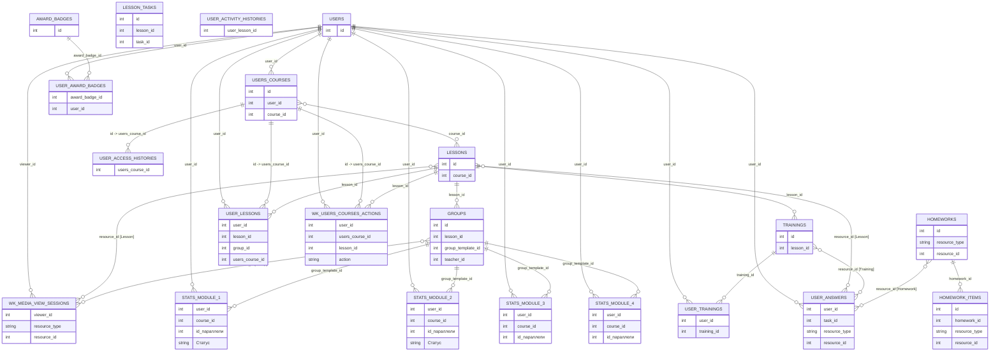

# Данные и ER-диаграмма: текущая поставка

## Источники

Описание ниже опирается на:

- текущие CSV из `hackathon/src`;
- текстовую документацию: `Хакатон_Цифриум_пояснения_по_датасету_Кейс_ML.md`;
- текстовую документацию по таргету: `target_Критерии_перевода.md`.

Важно:

- первый безымянный столбец в CSV выглядит как технический индекс выгрузки;
- во многих ID значения записаны с разделителями тысяч, например `1,106,681`;
- в нескольких ключевых таблицах есть явные `id` и `resource_id`, поэтому большая часть основных связей проверяется напрямую.

## Коротко

Текущая поставка состоит из трёх слоёв:

- сырые LMS-логи и справочники: `users`, `users_courses`, `lessons`, `user_lessons`, `user_answers`, `user_trainings`, `wk_users_courses_actions`, `wk_media_view_sessions`, `groups`, `trainings`, `lesson_tasks`, `homeworks`, `homework_items`, `user_access_histories`, `user_activity_histories`, `award_badges`, `user_award_badges`;
- сводные таблицы для модулей: `stats__module_1` ... `stats__module_4`;
- документация по критериям перевода между модулями.

Для таргета по документации особенно важны:

- `wk_media_view_sessions`;
- `groups`;
- `lessons`;
- `lesson_tasks`;
- `trainings`;
- `user_trainings`;
- `homeworks`;
- `homework_items`;
- `users_courses`;
- `user_answers`.

Сводные `stats__module_*` тоже важны:

- `stats__module_1` и `stats__module_2` содержат готовый столбец `Статус` со значениями `Завершил`, `Отчислен`;
- `stats__module_3` и `stats__module_4` не содержат `Статус`.

## Состав файлов

| Файл | Строк | Гранулярность | Главные ID / ключи | Содержание |
|---|---:|---|---|---|
| `users.csv` | 95,395 | пользователь | `id` | профиль пользователя |
| `users_courses.csv` | 290,835 | пользователь на курсе | `id`, `user_id`, `course_id` | состояние курса, доступ, баллы |
| `lessons.csv` | 3,369 | урок | `id`, `course_id` | структура уроков курса |
| `groups.csv` | 13,076 | вебинар / показ урока | `id`, `lesson_id`, `group_template_id` | онлайн-вебинары и фактическое время проведения |
| `trainings.csv` | 410 | тренинг | `id`, `lesson_id` | метаданные тренингов |
| `lesson_tasks.csv` | 29,544 | задача в уроке | `id`, `lesson_id`, `task_id` | задачи, их порядок и обязательность |
| `homeworks.csv` | 1,226 | домашнее задание | `id`, `resource_type`, `resource_id` | ДЗ, собранные по урокам / материалам / событиям |
| `homework_items.csv` | 5,901 | элемент ДЗ | `id`, `homework_id`, `resource_type`, `resource_id` | отдельные требования внутри ДЗ |
| `user_access_histories.csv` | 667,124 | история доступа пользователя к курсу | `users_course_id` | интервалы доступа к курсу |
| `user_lessons.csv` | 3,070,664 | пользователь на уроке | `user_id`, `lesson_id`, `users_course_id`, `group_id` | посещение и прогресс по урокам |
| `user_activity_histories.csv` | 3,031,137 | действие в LMS | `user_lesson_id` | история действий внутри урока |
| `user_answers.csv` | 15,176,182 | ответ пользователя | `user_id`, `task_id`, `resource_type`, `resource_id` | ответы по задачам |
| `user_trainings.csv` | 427,628 | пользователь на тренинге | `user_id`, `training_id` | прохождение тренингов и оценки |
| `wk_users_courses_actions.csv` | 12,909,207 | событие на курсе | `user_id`, `users_course_id`, `lesson_id`, `action` | event-log действий на курсе |
| `wk_media_view_sessions.csv` | 852,358 | сессия просмотра медиа | `viewer_id`, `resource_type`, `resource_id` | просмотры записей и вебинаров |
| `award_badges.csv` | 6 | тип награды | `id` | справочник наград |
| `user_award_badges.csv` | 252,843 | выданная награда | `award_badge_id`, `user_id` | выданные пользователям награды |
| `stats__module_1.csv` | 3,261 | пользователь в модуле 1 | `user_id`, `course_id`, `id параллели` | сводка критериев + `Статус` |
| `stats__module_2.csv` | 1,955 | пользователь в модуле 2 | `user_id`, `course_id`, `id параллели` | сводка критериев + `Статус` |
| `stats__module_3.csv` | 1,785 | пользователь в модуле 3 | `user_id`, `course_id`, `id параллели` | сводка критериев без `Статус` |
| `stats__module_4.csv` | 1,707 | пользователь в модуле 4 | `user_id`, `course_id`, `id параллели` | сводка критериев без `Статус` |

## Таблицы, которые уже можно использовать для target

По документации критерии перевода опираются на такие условия:

1. минимум один вебинар посещён онлайн;
2. просмотрено 80% занятий и 80% контента;
3. решены все обязательные задачи;
4. пройден текущий контроль;
5. пройдена рефлексия;
6. пройдена промежуточная аттестация (`>= 8` баллов).

С текущей поставкой это лучше всего раскладывается так:

- вебинары и просмотры: `groups`, `wk_media_view_sessions`, частично `user_lessons`, `wk_users_courses_actions`;
- задачи и обязательный минимум: `lesson_tasks`, `user_answers`, частично `homeworks`, `homework_items`;
- тренинги и оценки: `trainings`, `user_trainings`;
- курс, доступ и накопленные баллы: `users_courses`, `user_access_histories`, `user_lessons`, `wk_users_courses_actions`;
- готовые target-like метки по модулям: `stats__module_1`, `stats__module_2`.

## Подтверждённые связи

Ниже перечислены связи, которые подтверждаются и документацией, и текущими CSV.

- `users.id -> users_courses.user_id` — `100%` покрытие уникальных `user_id` из `users_courses`.
- `users.id -> user_answers.user_id` — `100%`.
- `users.id -> user_trainings.user_id` — `100%`.
- `users.id -> wk_media_view_sessions.viewer_id` — `100%`.
- `users.id -> user_lessons.user_id` — `99.96%`.
- `users.id -> wk_users_courses_actions.user_id` — `99.96%`.
- `users.id -> user_award_badges.user_id` — `97.45%`.

- `users_courses.id -> user_access_histories.users_course_id` — `99.99%`.
- `users_courses.id -> user_lessons.users_course_id` — `99.98%`.
- `users_courses.id -> wk_users_courses_actions.users_course_id` — `99.98%`.

- `users_courses.course_id -> lessons.course_id` — `99` курсов из `137` course_id в `lessons`; в `users_courses` всего `99` уникальных `course_id`.

- `lessons.id -> user_lessons.lesson_id` — `98.24%`.
- `lessons.id -> wk_users_courses_actions.lesson_id` — `100%` для непустых `lesson_id`.
- `lessons.id -> groups.lesson_id` — `99.76%`.
- `lessons.id -> trainings.lesson_id` — `98.44%`.

- `user_answers.resource_id[Lesson] -> lessons.id` — `98.1%`.
- `user_answers.resource_id[Training] -> trainings.id` — `100%`.
- `user_answers.resource_id[Homework] -> homeworks.id` — `100%`.

- `wk_media_view_sessions.resource_id[Lesson] -> lessons.id` — `100%`.
- `wk_media_view_sessions.resource_id[Group] -> groups.id` — `100%`.

- `user_award_badges.award_badge_id -> award_badges.id` — `100%`.

- `homework_items.homework_id -> homeworks.id` — `100%`.

- `stats__module_1.user_id -> users.id` — `100%`.
- `stats__module_2.user_id -> users.id` — `100%`.
- `stats__module_3.user_id -> users.id` — `100%`.
- `stats__module_4.user_id -> users.id` — `100%`.

- `stats__module_1.course_id -> users_courses.course_id` — `100%`.
- `stats__module_2.course_id -> users_courses.course_id` — `100%`.
- `stats__module_3.course_id -> users_courses.course_id` — `100%`.
- `stats__module_4.course_id -> users_courses.course_id` — `100%`.

- `stats__module_*.id параллели -> groups.group_template_id` — `100%` для всех четырёх модулей.

## Неполные или проблемные связи

Это текущие места, где документация и данные не замыкаются до конца.

- В `user_activity_histories.csv` есть `user_lesson_id`, но в `user_lessons.csv` нет явного `id` или `user_lesson_id`. Поэтому `user_activity_histories` по-прежнему нельзя напрямую связать с остальными таблицами.

- `lesson_tasks.lesson_id -> lessons.id` покрывается только на `57%` уникальных `lesson_id`. Значит, `lesson_tasks` описывает более широкий набор уроков, чем текущий `lessons.csv`, или же `lessons.csv` выгружен не полностью относительно задач.

- `lesson_tasks.task_id -> user_answers.task_id` покрывается только на `37.72%` уникальных `task_id` из `lesson_tasks`. Следовательно, в `user_answers` и `lesson_tasks` живут не полностью совпадающие подмножества задач.

- `homeworks.resource_id[Lesson] -> lessons.id` покрывается только на `27.51%`. По документации это должен быть ID урока, но в текущей поставке большая часть этих ID не находится в `lessons.csv`.

- В `homeworks.csv` есть `resource_type = LessonMaterial`, но отдельной таблицы материалов уроков в поставке нет.

- В `homeworks.csv` есть одна строка с `resource_type = Event`, но её `resource_id` не матчится с `groups.id`.

- `homework_items.resource_id[Task] -> lesson_tasks.task_id` покрывается только на `23.33%`. Значит, `homework_items` ссылается на более широкий мир задач, чем текущий `lesson_tasks.csv`.

- В `homework_items.csv` есть `resource_type = CommonFile` и `Video`, но таблиц для этих сущностей в поставке нет.

- `groups.group_template_id` по смыслу похож на `user_lessons.group_id` (оба описаны как “id параллели”), но фактическое пересечение равно `0%`. Эти поля нельзя считать одним и тем же ключом.

- `groups.teacher_id` не матчится с `users.id` (`0%`), хотя `stats__module_*.teacher_id` матчится с `users.id` на `100%`. Значит, `teacher_id` в `groups` и `teacher_id` в `stats__module_*` живут в разных пространствах идентификаторов.

- `wk_users_courses_actions.sourceable_id` почти не помогает для связности: оно заполнено только у `visit_preparation_material`, а для `start_training`, `user_answer`, `visit_video`, `visit_translation` пусто.

## Что это значит для таргета

С текущей поставкой target можно строить заметно полнее, потому что в данных есть:

- явный `users_courses.id`;
- явный `lessons.id`;
- `resource_id` в `user_answers`;
- `resource_id` в `wk_media_view_sessions`;
- явный `award_badges.id`;
- `trainings.csv`;
- `groups.csv`, `lesson_tasks.csv`, `homeworks.csv`, `homework_items.csv`;
- `stats__module_1/2` с готовым `Статус`.

Но для полностью “честного” raw target всё ещё мешают:

- отсутствие явного `user_lesson_id` в `user_lessons`;
- неполная связность вокруг `lesson_tasks`, `homeworks`, `homework_items`;
- несогласованные teacher/group IDs в части таблиц.

Практически это означает:

- `stats__module_1` и `stats__module_2` уже можно использовать как source of truth для target по первым двум модулям;
- raw LMS target по критериям перевода можно собирать намного лучше, но не для всех критериев и не по всем таблицам без оговорок;
- `user_activity_histories` пока остаётся наиболее изолированной таблицей.

## Краткие описания таблиц

### `users.csv`

Пользователи LMS. Главный ключ — `id`.

Поля: `Unnamed: 0`, `id`, `last_explainer_seen_→_course`, `created_at`, `updated_at`, `type`, `remember_created_at`, `sign_in_count`, `current_sign_in_at`, `last_sign_in_at`, `grade_id`, `subscribed`, `grade_checked`, `is_teacher`, `timezone`, `grade_changed_at`, `xp`, `d_wk_school_id`, `d_wk_municipal_id`, `d_wk_region_id`, `d_updated_at`, `wk_gender`.

### `users_courses.csv`

Основа уровня `user-course`. Явный ключ — `id`.

Поля: `Unnamed: 0`, `id`, `user_id`, `course_id`, `state`, `created_at`, `updated_at`, `access_finished_at`, `wk_points`, `wk_max_points`, `wk_max_viewable_lessons`, `wk_max_task_count`, `wk_officially_started_at`, `wk_course_completed_at`.

### `lessons.csv`

Справочник уроков. Явный ключ — `id`.

Поля: `Unnamed: 0`, `id`, `course_id`, `conspect_expected`, `task_expected`, `lesson_number`, `wk_max_points`, `wk_task_count`, `wk_survival_training_expected`, `wk_scratch_playground_enabled`, `wk_attendance_tracking_enabled`, `wk_video_duration`, `wk_attendance_tracking_disabled_at`.

### `groups.csv`

Вебинары / показы уроков. Явный ключ — `id`.

Поля: `Unnamed: 0`, `id`, `lesson_id`, `teacher_id`, `starts_at`, `duration`, `state`, `group_template_id`, `video_available`, `pupils_notified_at`, `wk_actual_started_at`, `wk_actual_finished_at`, `wk_duration_actual`.

### `trainings.csv`

Справочник тренингов. Явный ключ — `id`.

Поля: `Unnamed: 0`, `id`, `name`, `discipline_id`, `time_limit`, `published_at`, `difficulty`, `lesson_id`, `task_templates_count`.

### `lesson_tasks.csv`

Задачи внутри уроков. Явный ключ — `id`.

Поля: `Unnamed: 0`, `id`, `lesson_id`, `task_id`, `position`, `task_required`.

### `homeworks.csv`

Справочник домашних заданий. Явный ключ — `id`.

Поля: `Unnamed: 0`, `id`, `resource_type`, `resource_id`, `homework_type`.

### `homework_items.csv`

Элементы домашнего задания. Явный ключ — `id`.

Поля: `Unnamed: 0`, `id`, `homework_id`, `resource_type`, `resource_id`, `position`.

### `user_access_histories.csv`

История выдачи доступа к курсу. Ключ в данных — `users_course_id`.

Поля: `Unnamed: 0`, `users_course_id`, `access_started_at`, `access_expired_at`, `activator_class`.

### `user_lessons.csv`

Урок пользователя внутри курса. Явного `id` в CSV нет.

Поля: `Unnamed: 0`, `user_id`, `lesson_id`, `group_id`, `video_visited`, `translation_visited`, `users_course_id`, `solved`, `solved_tasks_count`, `wk_points`, `video_viewed`, `wk_solved_task_count`.

### `user_activity_histories.csv`

События пользователя внутри урока. Ключ в документации — `user_lesson_id`, но мост к `user_lessons` в текущем CSV отсутствует.

Поля: `Unnamed: 0`, `user_lesson_id`, `action`, `created_at`.

### `user_answers.csv`

Ответы по задачам.

Поля: `Unnamed: 0`, `user_id`, `task_id`, `attempts`, `solved`, `points`, `max_attempts`, `results`, `skipped`, `resource_type`, `resource_id`, `submitted_at`, `wk_partial_answer`, `performance`, `async_check_status`.

### `user_trainings.csv`

Прохождение тренингов пользователем.

Поля: `Unnamed: 0`, `user_id`, `training_id`, `solved_tasks_count`, `earned_points`, `type`, `state`, `submitted_answers_count`, `started_at`, `finished_at`, `attempts`, `mark`, `mark_saved_at`.

### `wk_users_courses_actions.csv`

Event-log действий пользователя на курсе.

Поля: `Unnamed: 0`, `user_id`, `users_course_id`, `sourceable_id`, `action`, `created_at`, `updated_at`, `lesson_id`.

### `wk_media_view_sessions.csv`

Просмотры медиа.

Поля: `Unnamed: 0`, `resource_type`, `resource_id`, `viewer_id`, `segments_total`, `viewed_segments_count`, `started_at`, `kind`.

### `award_badges.csv`

Справочник наград. Явный ключ — `id`.

Поля: `Unnamed: 0`, `id`, `name`, `title`, `level`, `quota`, `special`, `unlocked_small_image_url`.

### `user_award_badges.csv`

Выданные пользователям награды.

Поля: `Unnamed: 0`, `award_badge_id`, `user_id`, `created_at`.

### `stats__module_1.csv`

Сводная таблица по первому модулю. Содержит готовый target `Статус`.

Поля: `Unnamed: 0`, `user_id`, `Кружок`, `teacher_id`, `Дата зачисления`, `id параллели`, `Уровень`, `course_id`, `Просмотрел уроков`, `Просмотрено контента`, `Просмотрено 80% ур или видеоконт`, `Посетил урок в онлайне`, `Решено ИЗ`, `Решены все обяз.ИЗ`, `Пройден тек.контроль`, `Балл ПА`, `Сдал ПА`, `Дата сдачи ПА (МСК)`, `Статус`.

### `stats__module_2.csv`

Сводная таблица по второму модулю. Содержит готовый target `Статус`.

Поля: `Unnamed: 0`, `user_id`, `Кружок`, `teacher_id`, `course_id`, `id параллели`, `Уровень`, `Посмотрел уроков на 80%`, `Просмотрено контента (ед)`, `Просмотрено 720ед видеоконт и 80% ур `, `Смотрел уроков`, `Посетил урок в онлайне`, `Решено ИЗ`, `Решены все обяз.ИЗ`, `Пройден тек.контроль`, `Балл ПА`, `Сдал ПА`, `Дата сдачи ПА (МСК)`, `Пройдена рефлексия`, `Статус`.

### `stats__module_3.csv`

Сводная таблица по третьему модулю. Столбца `Статус` нет.

Поля: `Unnamed: 0`, `user_id`, `Кружок`, `teacher_id`, `course_id`, `id параллели`, `Посмотрел уроков на 80%`, `Смотрел уроков`, `Посетил урок в онлайне`, `Просмотрено контента (ед)`, `Просмотрено 720ед видеоконт и 80% ур `, `Решено ИЗ`, `Решены все обяз.ИЗ`, `Пройден тек.контроль`, `Балл ПА`, `Сдал ПА`, `Дата сдачи ПА (МСК)`, `Уровень`, `Пройдена рефлексия`.

### `stats__module_4.csv`

Сводная таблица по четвёртому модулю. Столбца `Статус` нет.

Поля: `Unnamed: 0`, `user_id`, `Кружок`, `teacher_id`, `course_id`, `id параллели`, `Посмотрел уроков на 80%`, `Смотрел уроков`, `Посетил урок в онлайне`, `Просмотрено контента (ед)`, `Просмотрено 720ед видеоконт и 80% ур `, `Решено ИЗ`, `Решены все обяз.ИЗ`, `Пройден тек.контроль`, `Сдал ПА`, `Уровень`, `Пройдена рефлексия`, `Сдал ИА`.

## ER-диаграмма

