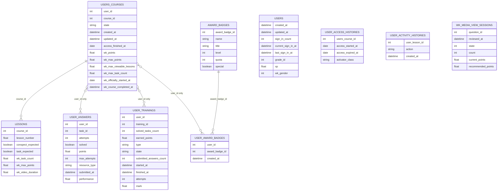

# Данные и ER-диаграмма

## Коротко

Уникальные файлы:

- `award_badges.csv`
- `lessons.csv`
- `user_access_histories.csv`
- `user_activity_histories.csv`
- `user_answers.csv`
- `user_award_badges.csv`
- `user_trainings.csv`
- `users.csv`
- `users_courses.csv`
- `wk_media_view_sessions.csv`

Дубликаты файлов:

- `lessons.csv` = `user_lessons.csv` = `xp_awards.csv`
- `user_answers.csv` = `wk_users_courses_actions.csv`
- `user_access_histories.csv` = `xp_ratings.csv`

Рабочее ядро схемы:

- `users_courses.csv` — основная таблица `user-course`
- `lessons.csv` — структура курса
- `user_answers.csv`, `user_trainings.csv`, `user_award_badges.csv` — события и активность пользователя

Слабосвязанные таблицы:

- `users.csv` — в текущей выгрузке нет явного `user_id`
- `user_access_histories.csv` — `users_course_id` не стыкуется с текущей `users_courses.csv`
- `user_activity_histories.csv` — нет bridge-таблицы для `user_lesson_id`
- `wk_media_view_sessions.csv` — нет явной связи с курсом и пользователем

## `Unnamed: 0`

Во всех уникальных таблицах `Unnamed: 0`:

- уникален
- без пропусков
- идёт подряд от `0` до `n-1`

Это технический индекс строки / локальный surrogate key. Внутри таблицы он может служить ID записи, но как внешний ключ между таблицами не работает.

## Таблицы и колонки

### `users_courses.csv`

Роль: основная таблица `user-course`.

| Колонка | Тип | Описание |
|---|---|---|
| `Unnamed: 0` | `int64` | Технический ID строки |
| `user_id` | `int64` | Идентификатор пользователя |
| `course_id` | `int64` | Идентификатор курса |
| `state` | `object` | Статус записи: `active`, `inactive` |
| `created_at` | `object/datetime` | Когда пользователь попал на курс |
| `updated_at` | `object/datetime` | Последнее обновление записи |
| `group_template_id` | `float64` | Идентификатор шаблона/группы |
| `access_finished_at` | `object/date` | Когда заканчивается доступ к курсу |
| `wk_points` | `float64` | Набранные баллы |
| `wk_max_points` | `float64` | Максимально возможные баллы |
| `wk_max_viewable_lessons` | `float64` | Сколько уроков доступно для просмотра |
| `wk_max_task_count` | `float64` | Максимальное число задач |
| `wk_officially_started_at` | `object/date` | Официальная дата старта курса |
| `wk_course_completed_at` | `object/datetime` | Дата завершения курса |

### `lessons.csv`

Роль: структура курса и свойства уроков.

| Колонка | Тип | Описание |
|---|---|---|
| `Unnamed: 0` | `int64` | Технический ID строки |
| `course_id` | `int64` | Идентификатор курса |
| `conspect_expected` | `bool` | Ожидается ли теория/конспект: `True`, `False` |
| `task_expected` | `bool` | Ожидается ли задание: `True`, `False` |
| `lesson_number` | `float64` | Порядковый номер урока |
| `wk_max_points` | `float64` | Максимум баллов за урок |
| `wk_task_count` | `float64` | Число задач в уроке |
| `wk_survival_training_expected` | `bool` | Есть ли survival training: `True`, `False` |
| `wk_scratch_playground_enabled` | `bool` | Включена ли практика/песочница: `True`, `False` |
| `wk_attendance_tracking_enabled` | `bool` | Включён ли трекинг посещаемости: `True`, `False` |
| `wk_video_duration` | `float64` | Длительность видео/материала |
| `wk_attendance_tracking_disabled_at` | `object/datetime` | Когда отключили attendance tracking; встречаются `23 Dec, 2025, 22:25`, `19 Jan, 2026, 11:05` |

### `user_answers.csv`

Роль: попытки и отправки ответов пользователя.

Ограничение: нет `course_id`, связь только по `user_id`.

| Колонка | Тип | Описание |
|---|---|---|
| `Unnamed: 0` | `int64` | Технический ID строки |
| `user_id` | `int64` | Идентификатор пользователя |
| `task_id` | `int64` | Идентификатор задачи |
| `attempts` | `int64` | Число попыток: `0`, `1` |
| `solved` | `object/bool` | Решена ли задача: `True`, `False` |
| `points` | `float64` | Набранные баллы |
| `max_attempts` | `int64` | Максимум попыток: `1`, `2` |
| `results` | `object` | Детальные результаты проверки |
| `skipped` | `object/bool` | Признак пропуска: `True`, `False` |
| `resource_type` | `object` | Тип ресурса: `Lesson`, `Training`, `Homework` |
| `submitted_at` | `object/datetime` | Время отправки |
| `wk_partial_answer` | `object` | Признак частичного ответа: `True`, `False` |
| `performance` | `float64` | Нормализованная успешность: `0.0`, `0.5`, `1.0` |
| `async_check_status` | `int64` | Статус асинхронной проверки: `0`, `2` |

### `user_trainings.csv`

Роль: прохождение тренингов и тестов.

Ограничение: нет `course_id`, связь только по `user_id`.

| Колонка | Тип | Описание |
|---|---|---|
| `Unnamed: 0` | `int64` | Технический ID строки |
| `user_id` | `int64` | Идентификатор пользователя |
| `training_id` | `int64` | Идентификатор тренинга |
| `solved_tasks_count` | `int64` | Сколько задач решено |
| `earned_points` | `float64` | Набранные баллы |
| `type` | `object` | Тип тренинга: `UserTrainings::LessonTraining`, `UserTrainings::RegularTraining`, `UserTrainings::OlympiadTraining` |
| `state` | `object` | Статус: `checked`, `started` |
| `submitted_answers_count` | `int64` | Число отправленных ответов |
| `started_at` | `object/datetime` | Время старта |
| `finished_at` | `object/datetime` | Время завершения |
| `attempts` | `int64` | Число попыток; в выгрузке только `1` |
| `mark` | `float64` | Оценка: `2.0`, `3.0`, `4.0`, `5.0` |
| `mark_saved_at` | `object/datetime` | Когда сохранена оценка |

### `user_award_badges.csv`

Роль: выдача бейджа пользователю.

| Колонка | Тип | Описание |
|---|---|---|
| `Unnamed: 0` | `int64` | Технический ID строки |
| `award_badge_id` | `int64` | Тип выданного бейджа: `1`, `2`, `3`, `4`, `5`, `6` |
| `user_id` | `int64` | Идентификатор пользователя |
| `created_at` | `object/datetime` | Время выдачи |

### `award_badges.csv`

Роль: справочник бейджей.

| Колонка | Тип | Описание |
|---|---|---|
| `Unnamed: 0` | `int64` | Технический ID строки |
| `name` | `object` | Системное имя бейджа: `AwardBadges::OlympiadParticipant`, `AwardBadges::Solving` |
| `title` | `object` | Название бейджа: `Олимпиадник`, `Я решаю` |
| `level` | `int64` | Уровень бейджа: `1`, `2`, `3`, `4`, `5` |
| `quota` | `int64` | Порог получения: `1`, `5`, `25`, `50`, `100`, `500` |
| `special` | `bool` | Специальный бейдж или нет: `True`, `False` |
| `unlocked_small_image_url` | `object` | URL картинки бейджа |

### `users.csv`

Роль: профиль пользователя.

Ограничение: в текущей выгрузке нет явного `user_id`.

| Колонка | Тип | Описание |
|---|---|---|
| `Unnamed: 0` | `int64` | Технический ID строки |
| `last_explainer_seen_→_course` | `float64` | Последний seen explainer/course: `1.0`, `2.0`, `3.0`, `4.0`, `5.0`, `6.0`, `7.0` |
| `created_at` | `object/datetime` | Дата создания пользователя |
| `updated_at` | `object/datetime` | Последнее обновление записи |
| `type` | `object` | Тип пользователя: `User::Pupil`, `User::Agent` |
| `remember_created_at` | `object/datetime` | Техническое поле remember-me |
| `sign_in_count` | `int64` | Число входов |
| `current_sign_in_at` | `object/datetime` | Последний текущий вход |
| `last_sign_in_at` | `object/datetime` | Предыдущий вход |
| `grade_id` | `int64` | Класс/уровень обучения |
| `subscribed` | `bool` | Подписан ли пользователь: `True`, `False` |
| `grade_checked` | `bool` | Проверен ли класс: `True`, `False` |
| `is_teacher` | `bool` | Признак преподавателя; в выгрузке только `False` |
| `timezone` | `object` | Часовой пояс |
| `grade_changed_at` | `object/datetime` | Когда менялся класс |
| `xp` | `int64` | Очки опыта |
| `d_wk_school_id` | `float64` | Идентификатор школы |
| `d_wk_municipal_id` | `float64` | Идентификатор муниципалитета |
| `d_wk_region_id` | `float64` | Идентификатор региона |
| `d_updated_at` | `object/datetime` | Техническое время обновления в DWH |
| `wk_gender` | `float64` | Пол: `1.0`, `2.0` |

### `user_access_histories.csv`

Роль: периоды доступа к курсу.

Ограничение: `users_course_id` сейчас не связывается с `users_courses.csv`.

| Колонка | Тип | Описание |
|---|---|---|
| `Unnamed: 0` | `int64` | Технический ID строки |
| `users_course_id` | `int64` | Идентификатор записи `user-course` в другой системе/выгрузке |
| `access_started_at` | `object/date` | Дата начала доступа |
| `access_expired_at` | `object/date` | Дата окончания доступа |
| `activator_class` | `object` | Механизм выдачи доступа: `Courses::AccessActivators::PremiumAccessActivator`, `Courses::AccessActivators::RevokeAccessActivator`, `Courses::AccessActivators::StandardAccessActivator`, `Courses::AccessActivators::ChangeAccessDurationActivator`, `Courses::AccessActivators::MonthPremiumAccessActivator` |

### `user_activity_histories.csv`

Роль: действия по пользовательскому уроку.

Ограничение: нет надёжной связи `user_lesson_id -> user_id/course_id`.

| Колонка | Тип | Описание |
|---|---|---|
| `Unnamed: 0` | `int64` | Технический ID строки |
| `user_lesson_id` | `object` | Идентификатор пользовательского урока |
| `action` | `object` | Тип действия: `visit_translation`, `visit_video`, `show_conspect` |
| `created_at` | `object/datetime` | Время действия |

### `wk_media_view_sessions.csv`

Роль: просмотры медиа / вопросов.

Ограничение: нет явной связи с пользователем и курсом.

| Колонка | Тип | Описание |
|---|---|---|
| `Unnamed: 0` | `int64` | Технический ID строки |
| `question_id` | `int64` | Идентификатор вопроса / медиа-единицы |
| `reviewed_at` | `object/datetime` | Время просмотра/проверки |
| `state` | `int64` | Технический статус: `1`, `2`, `3`, `4` |
| `count` | `object` | Число просмотров / срабатываний |
| `current_points` | `float64` | Текущие баллы |
| `recommended_points` | `float64` | Рекомендуемые баллы |

## ER-диаграмма

