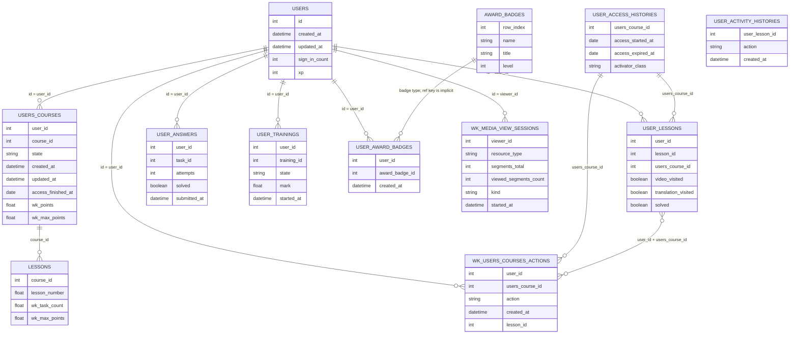

# Данные и ER-диаграмма

## Коротко

Описание ниже опирается в первую очередь на текстовую Notion-документацию. Если столбец в документации не описан, дано короткое техническое описание по фактическому CSV. Для временных полей указан диапазон непустых значений.

Важно:

- `Unnamed: 0` во всех CSV выглядит как локальный технический индекс строки.
- Многие ID в сырых CSV записаны с разделителем тысяч, например `718,902`.

Подтвержденные связи:

- `users.id -> users_courses.user_id`
- `users.id -> user_answers.user_id`
- `users.id -> user_trainings.user_id`
- `users.id -> user_lessons.user_id`
- `users.id -> wk_users_courses_actions.user_id`
- `users.id -> wk_media_view_sessions.viewer_id`
- `user_lessons.users_course_id -> user_access_histories.users_course_id`
- `wk_users_courses_actions.users_course_id -> user_access_histories.users_course_id`
- `users_courses.course_id -> lessons.course_id`

Неполные или не до конца подтвержденные связи:

- В `users_courses.csv` отсутствует `users_course_id`, поэтому эту таблицу нельзя напрямую связать с `user_lessons.csv`, `wk_users_courses_actions.csv` и `user_access_histories.csv`, где `users_course_id` есть.
- В `user_activity_histories.csv` есть `user_lesson_id`, но в `user_lessons.csv` отсутствует `user_lesson_id`, поэтому `user_activity_histories.csv` нельзя напрямую связать ни с одной другой таблицей.
- В `lessons.csv` отсутствует `lesson_id`, поэтому эту таблицу нельзя напрямую связать с `user_lessons.csv` и `wk_users_courses_actions.csv`, где `lesson_id` есть и по документации ссылается на урок из `lessons`.
- В `user_answers.csv` отсутствует `resource_id` из документации, а также нет `lesson_id`, `course_id` и `users_course_id`, поэтому эту таблицу нельзя напрямую связать с `lessons.csv`, `user_lessons.csv`, `users_courses.csv` и `wk_users_courses_actions.csv` на уровне конкретного урока или курса.
- В `award_badges.csv` отсутствует `award_badge_id`, поэтому эту таблицу нельзя напрямую связать с `user_award_badges.csv`, где `award_badge_id` есть.
- В `wk_media_view_sessions.csv` отсутствуют `lesson_id`, `course_id` и `users_course_id`, поэтому эту таблицу нельзя напрямую связать с course-level блоком: `users_courses.csv`, `user_lessons.csv`, `lessons.csv`, `wk_users_courses_actions.csv`. Она связана только с пользователем через `viewer_id`.

## Таблицы и колонки

### `users.csv` (95 395 строк)

Пользователи, зарегистрированные в LMS.

| Колонка | Тип | Описание |
|---|---|---|
| `Unnamed: 0` | `int64` | Технический индекс строки |
| `id` | `int64` | Идентификатор пользователя |
| `last_explainer_seen_→_course` | `float64` | Показывать ли пользователю онбординг на курс и с какого шага; всего 7 шагов: `1.0`, `2.0`, `3.0`, `4.0`, `5.0`, `6.0`, `7.0` |
| `created_at` | `object/datetime` | Время создания пользователя. Диапазон: `2025-01-31 14:16:00` - `2026-03-27 16:13:00` |
| `updated_at` | `object/datetime` | Время обновления записи пользователя. Диапазон: `2025-05-01 02:24:00` - `2025-05-31 20:35:00` |
| `type` | `object` | Тип пользователя: `User::Agent`, `User::Pupil` |
| `remember_created_at` | `object/datetime` | Ненужное поле. Диапазон: `2025-01-31 14:16:00` - `2026-03-27 16:44:00` |
| `sign_in_count` | `int64` | Количество логинов пользователя в LMS |
| `current_sign_in_at` | `object/datetime` | Ненужное поле. Диапазон: `2025-05-01 02:24:00` - `2025-05-31 21:45:00` |
| `last_sign_in_at` | `object/datetime` | Ненужное поле. Диапазон: `2025-02-17 06:46:00` - `2026-03-27 16:47:00` |
| `grade_id` | `object/int` | Класс пользователя |
| `subscribed` | `bool` | Подписан ли пользователь на email-рассылки: `False`, `True` |
| `grade_checked` | `bool` | Ненужное поле: `False`, `True` |
| `is_teacher` | `bool` | Является ли пользователь учителем: `False` |
| `timezone` | `object` | Таймзона пользователя |
| `grade_changed_at` | `object/datetime` | Время изменения класса. Диапазон: `2025-02-04 15:51:00` - `2026-03-26 14:58:00` |
| `xp` | `object/int` | Ненужное поле |
| `d_wk_school_id` | `object/int` | Идентификатор школы пользователя |
| `d_wk_municipal_id` | `object/int` | Идентификатор города/муниципалитета пользователя |
| `d_wk_region_id` | `object/int` | Идентификатор региона пользователя |
| `d_updated_at` | `object/datetime` | Ненужное поле. Диапазон: `2025-05-01 02:05:00` - `2025-05-31 19:43:00` |
| `wk_gender` | `float64` | Пол пользователя: `1.0`, `2.0` |

### `users_courses.csv` (290 835 строк)

Какие курсы проходит каждый пользователь и общая информация по ним: есть ли доступ, накопленные баллы и т.п.

| Колонка | Тип | Описание |
|---|---|---|
| `Unnamed: 0` | `int64` | Технический индекс строки |
| `user_id` | `object/int` | Идентификатор пользователя |
| `course_id` | `object/int` | Идентификатор курса |
| `state` | `object` | Активен ли доступ пользователя к курсу: `active`, `inactive` |
| `created_at` | `object/datetime` | Время создания записи `user-course`. Диапазон: `2025-02-07 11:33:00` - `2026-03-26 20:23:00` |
| `updated_at` | `object/datetime` | Время обновления записи `user-course`. Диапазон: `2025-02-19 07:00:00` - `2026-03-27 01:49:00` |
| `access_finished_at` | `object/date` | Таймкод: когда статус стал `inactive`; если сейчас статус `active`, то когда доступ закончится. Диапазон: `2025-02-16` - `2026-09-26` |
| `wk_points` | `float64` | Сколько баллов внутри курса набрал пользователь |
| `wk_max_points` | `float64` | Максимальное количество баллов, которое можно набрать на курсе |
| `wk_max_viewable_lessons` | `float64` | Максимальное количество уроков, которые можно пройти на курсе |
| `wk_max_task_count` | `float64` | Максимальное количество заданий, которые можно решить на курсе |
| `wk_officially_started_at` | `object/date` | Таймкод, когда пользователь начал прохождение курса. Диапазон: `2023-06-21` - `2026-02-23` |
| `wk_course_completed_at` | `object/datetime` | Таймкод, когда пользователь завершил курс. Диапазон: `2026-01-12 14:35:00` - `2026-03-26 17:26:00` |

### `lessons.csv` (3 369 строк)

Все существующие в LMS уроки по всем курсам.

| Колонка | Тип | Описание |
|---|---|---|
| `Unnamed: 0` | `int64` | Технический индекс строки |
| `course_id` | `object/int` | ID курса, к которому относится урок |
| `conspect_expected` | `bool` | Привязан ли к уроку конспект: `False`, `True` |
| `task_expected` | `bool` | Привязаны ли к уроку проверочные задания: `False`, `True` |
| `lesson_number` | `float64` | Порядковый номер урока в курсе |
| `wk_max_points` | `float64` | Максимальное количество баллов, которое можно заработать за задания к уроку |
| `wk_task_count` | `float64` | Количество заданий к уроку |
| `wk_survival_training_expected` | `bool` | Привязан ли к уроку тренажер на выживание: `False`, `True` |
| `wk_scratch_playground_enabled` | `bool` | Подключена ли внешняя интеграция со Scratch: `False`, `True` |
| `wk_attendance_tracking_enabled` | `bool` | Отслеживается ли посещение урока: `False`, `True` |
| `wk_video_duration` | `float64` | Длина видео к уроку |
| `wk_attendance_tracking_disabled_at` | `object/datetime` | Таймкод, когда отключили отслеживание посещения урока. Диапазон: `2025-12-23 22:25:00` - `2026-01-19 11:05:00` |

### `user_access_histories.csv` (667 124 строки)

История выдачи доступа пользователей к курсам.

| Колонка | Тип | Описание |
|---|---|---|
| `Unnamed: 0` | `int64` | Технический индекс строки |
| `users_course_id` | `int64` | ID курса из `users_courses` |
| `access_started_at` | `object/date` | Таймкод начала доступа к курсу. Диапазон: `2025-02-07` - `2026-03-27` |
| `access_expired_at` | `object/date` | Таймкод истечения срока доступа к курсу. Диапазон: `2025-02-16` - `2026-09-27` |
| `activator_class` | `object` | Тип доступа: `Courses::AccessActivators::ChangeAccessDurationActivator`, `Courses::AccessActivators::MonthPremiumAccessActivator`, `Courses::AccessActivators::PremiumAccessActivator`, `Courses::AccessActivators::RevokeAccessActivator`, `Courses::AccessActivators::StandardAccessActivator` |

### `user_lessons.csv` (3 070 664 строки)

Все существующие в LMS уроки по всем курсам, привязанные к пользователям.

| Колонка | Тип | Описание |
|---|---|---|
| `Unnamed: 0` | `int64` | Технический индекс строки |
| `user_id` | `object/int` | Идентификатор пользователя |
| `lesson_id` | `object/int` | ID урока из `lessons` |
| `group_id` | `object/int` | ID параллели |
| `video_visited` | `bool` | Была ли открыта пользователем запись вебинара в уроке: `False`, `True` |
| `translation_visited` | `bool` | Была ли открыта пользователем онлайн-трансляция вебинара в уроке: `False`, `True` |
| `users_course_id` | `object/int` | ID курса из `users_courses` |
| `solved` | `bool` | Решены ли пользователем все задания из урока: `False`, `True` |
| `solved_tasks_count` | `int64` | Количество решенных пользователем заданий из урока |
| `wk_points` | `float64` | Набранные пользователем баллы за этот урок |
| `video_viewed` | `bool` | Просмотрел ли пользователь видео к уроку: `False`, `True` |
| `wk_solved_task_count` | `float64` | Количество решенных пользователем заданий по уроку |

Комментарий: в текстовой документации для `user_lessons` отдельный `user_lesson_id` не перечислен.

### `user_activity_histories.csv` (3 031 137 строк)

История активностей пользователей в LMS.

| Колонка | Тип | Описание |
|---|---|---|
| `Unnamed: 0` | `int64` | Технический индекс строки |
| `user_lesson_id` | `object/int` | ID урока пользователя из `user_lessons` |
| `action` | `object` | Действие пользователя: `show_conspect`, `visit_translation`, `visit_video` |
| `created_at` | `object/datetime` | Таймкод действия. Диапазон: `2020-11-25 13:36:00` - `2026-03-31 15:20:00` |

Комментарий: Notion-документация явно ссылается на `user_lessons`, но в текущем `user_lessons.csv` нет столбца `user_lesson_id`.

### `user_answers.csv` (15 176 182 строки)

Ответы пользователей по всем заданиям.

| Колонка | Тип | Описание |
|---|---|---|
| `Unnamed: 0` | `int64` | Технический индекс строки |
| `user_id` | `object/int` | Идентификатор пользователя |
| `task_id` | `object/int` | ID задачи в системе |
| `attempts` | `int64` | Количество сделанных пользователем попыток: `0`, `1`, `2` |
| `solved` | `object/bool` | Решено ли задание: `False`, `True` |
| `points` | `float64` | Количество заработанных баллов за задание |
| `max_attempts` | `int64` | Максимальное количество попыток, доступных для задачи: `1`, `2` |
| `results` | `object` | Баллы за попытки |
| `skipped` | `object/bool` | Было ли задание пропущено пользователем: `False`, `True` |
| `resource_type` | `object` | В рамках какой активности было взаимодействие с задачей: `Homework`, `Lesson`, `Training` |
| `submitted_at` | `object/datetime` | Таймкод сдачи пользователем последнего ответа. Диапазон: `2025-02-17 16:43:00` - `2026-03-31 16:04:00` |
| `wk_partial_answer` | `object/bool` | Ответ дан частично (`True`) или полностью (`False`): `False`, `True` |
| `performance` | `float64` | Ненужное поле: `0.0`, `0.5`, `1.0` |
| `async_check_status` | `int64` | Статус готовности для асинхронных задач: `0`, `1`, `2` |

Комментарий: в Notion дополнительно описан `resource_id`, но в текущем CSV этого столбца нет.

### `user_trainings.csv` (427 628 строк)

Какие тренинги проходит каждый пользователь.

| Колонка | Тип | Описание |
|---|---|---|
| `Unnamed: 0` | `int64` | Технический индекс строки |
| `user_id` | `object/int` | Идентификатор пользователя |
| `training_id` | `object/int` | ID тренинга |
| `solved_tasks_count` | `int64` | Количество решенных пользователем заданий |
| `earned_points` | `float64` | Набранный балл за весь тренинг |
| `type` | `object` | Тип тренинга: `UserTrainings::LessonTraining`, `UserTrainings::OlympiadTraining`, `UserTrainings::RegularTraining` |
| `state` | `object` | Статус прохождения: `checked`, `started` |
| `submitted_answers_count` | `int64` | Количество ответов, отправленных в рамках тренинга |
| `started_at` | `object/datetime` | Таймкод начала прохождения тренинга. Диапазон: `2025-02-17 08:47:00` - `2026-03-27 17:07:00` |
| `finished_at` | `object/datetime` | Таймкод завершения прохождения тренинга. Диапазон: `2025-02-17 16:44:00` - `2026-03-27 17:06:00` |
| `attempts` | `int64` | Количество попыток пройти тренинг: `1` |
| `mark` | `float64` | Оценка за прохождение тренинга |
| `mark_saved_at` | `object/datetime` | Таймкод выставления оценки. Диапазон: `2025-02-17 16:44:00` - `2026-03-27 17:06:00` |

### `wk_users_courses_actions.csv` (12 909 207 строк)

Активность пользователей на курсах.

| Колонка | Тип | Описание |
|---|---|---|
| `Unnamed: 0` | `int64` | Технический индекс строки |
| `user_id` | `object/int` | Идентификатор пользователя |
| `users_course_id` | `object/int` | ID записи из `users_courses` |
| `sourceable_id` | `float64` | Ненужное поле |
| `action` | `object` | Совершенное пользователем действие: `scratch_playground_visited`, `start_training`, `user_answer`, `visit_preparation_material`, `visit_translation`, `visit_video` |
| `created_at` | `object/datetime` | Таймкод совершения действия. Диапазон: `2025-02-17 11:35:00` - `2026-03-31 14:12:00` |
| `updated_at` | `object/datetime` | Последнее обновление строки. Диапазон: `2025-02-17 11:35:00` - `2026-03-31 14:12:00` |
| `lesson_id` | `object/int` | ID урока из `lessons`, в рамках которого производилось действие |

### `wk_media_view_sessions.csv` (852 358 строк)

Данные по сессиям просмотров медиа-контента внутри LMS.

| Колонка | Тип | Описание |
|---|---|---|
| `Unnamed: 0` | `int64` | Технический индекс строки |
| `resource_type` | `object` | Какой тип контента смотрел пользователь: `Group`, `Lesson` |
| `viewer_id` | `object/int` | ID пользователя из `users` |
| `segments_total` | `int64` | Общее количество сегментов медиа |
| `viewed_segments_count` | `int64` | Количество просмотренных сегментов |
| `started_at` | `object/datetime` | Таймкод начала просмотра. Диапазон: `2025-03-28 05:58:00` - `2026-03-27 14:08:00` |
| `kind` | `object` | Вид медиа: `kinescope`, `ulms_live`, `ulms_vod` |

### `award_badges.csv` (6 строк)

Типы наград в LMS.

| Колонка | Тип | Описание |
|---|---|---|
| `Unnamed: 0` | `int64` | Технический индекс строки |
| `name` | `object` | Ненужное поле |
| `title` | `object` | Название награды: `Олимпиадник`, `Я решаю` |
| `level` | `int64` | Уровень награды |
| `quota` | `int64` | Что нужно сделать для получения награды |
| `special` | `bool` | Категория награды: `False`, `True` |
| `unlocked_small_image_url` | `object` | Ссылка на иллюстрацию |

### `user_award_badges.csv` (252 843 строки)

Присвоенные в LMS пользователям награды/достижения.

| Колонка | Тип | Описание |
|---|---|---|
| `Unnamed: 0` | `int64` | Технический индекс строки |
| `award_badge_id` | `int64` | ID награды из `award_badges` |
| `user_id` | `object/int` | ID пользователя из `users` |
| `created_at` | `object/datetime` | Таймкод присвоения награды. Диапазон: `2023-10-03 12:53:00` - `2026-03-27 17:18:00` |

## ER-диаграмма

