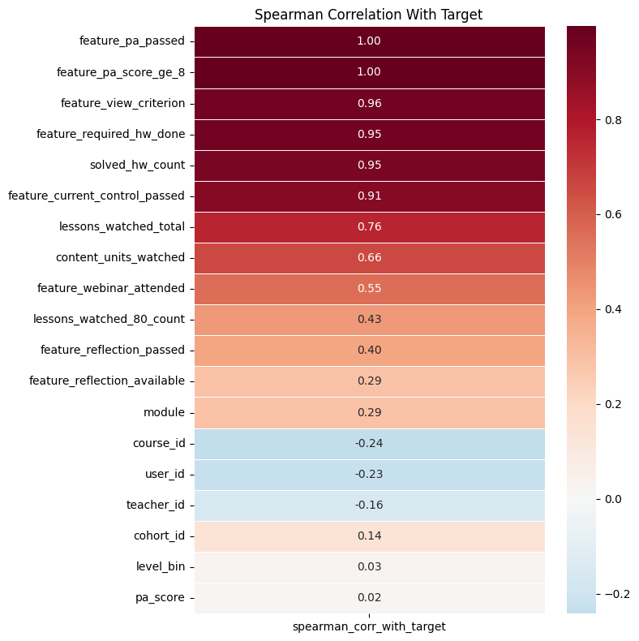
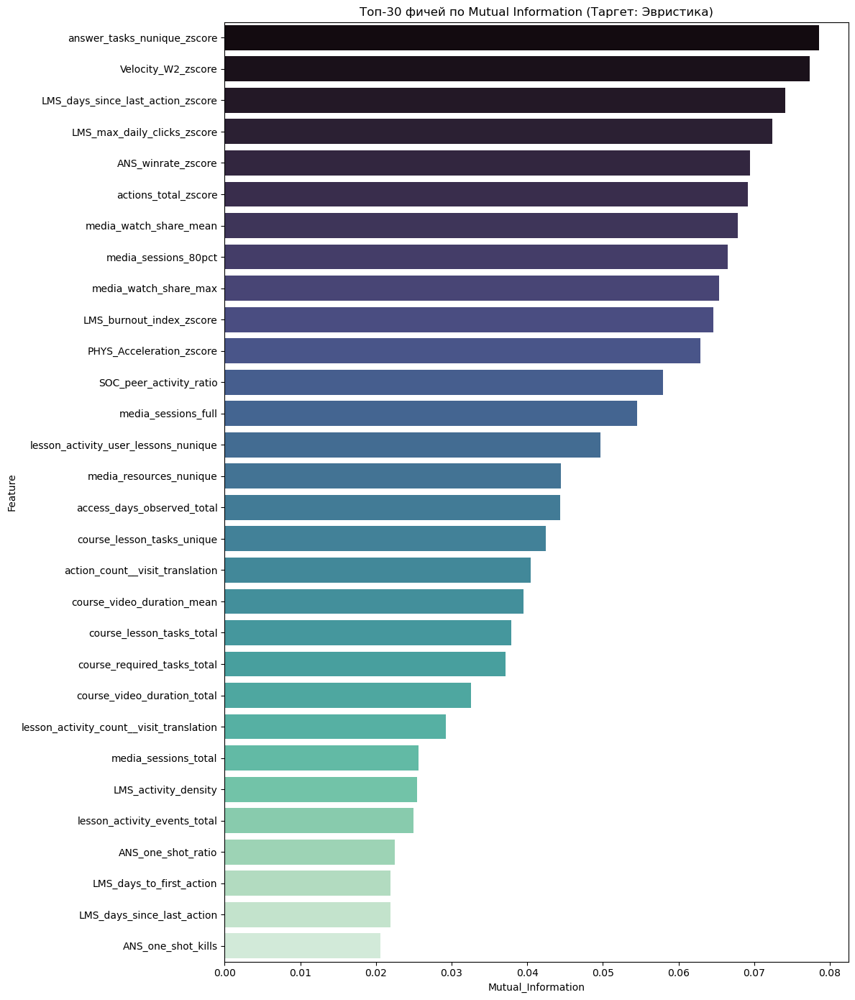
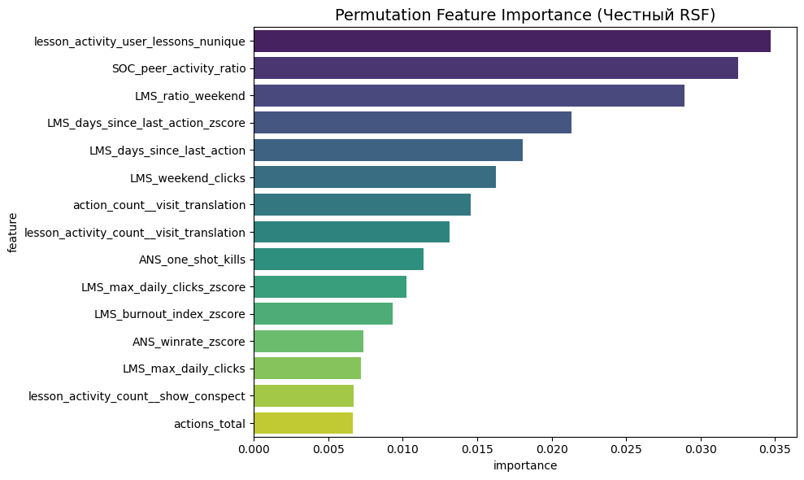
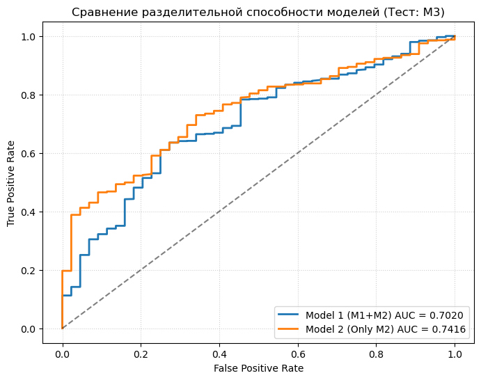
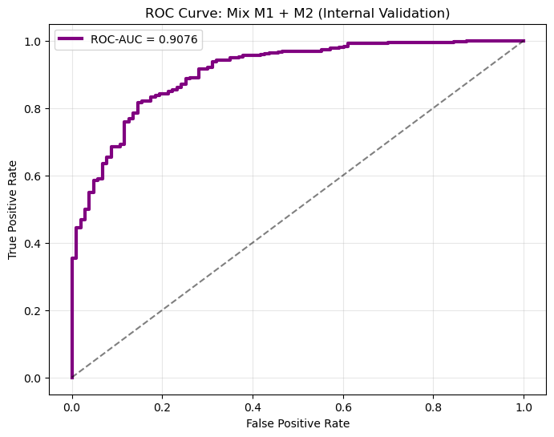
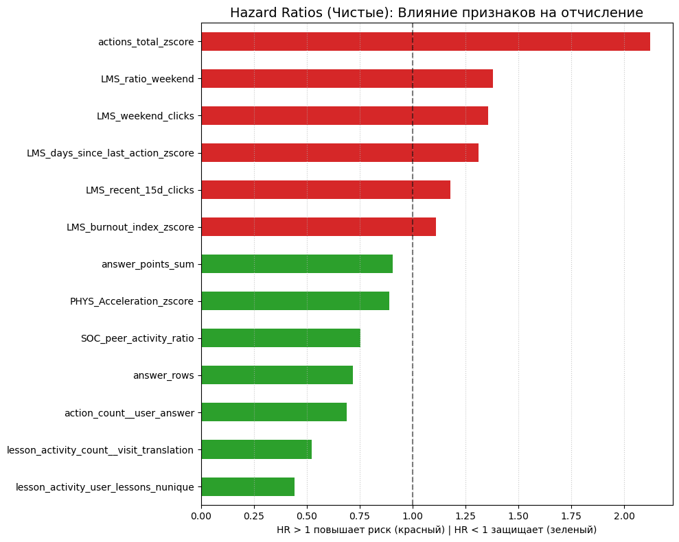
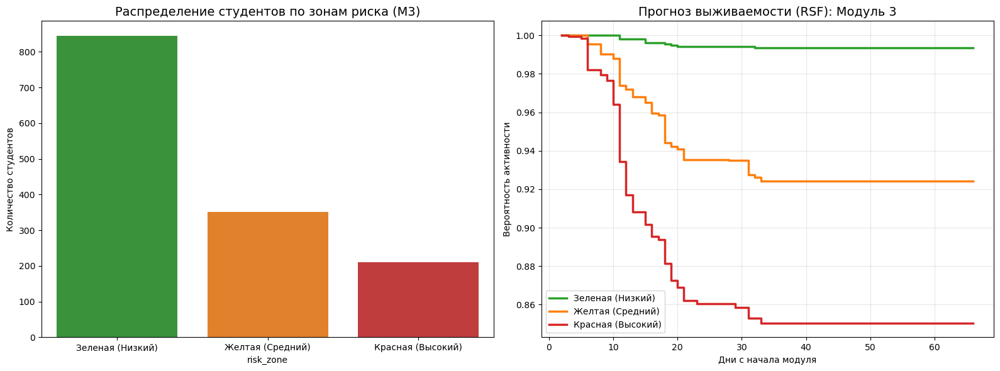
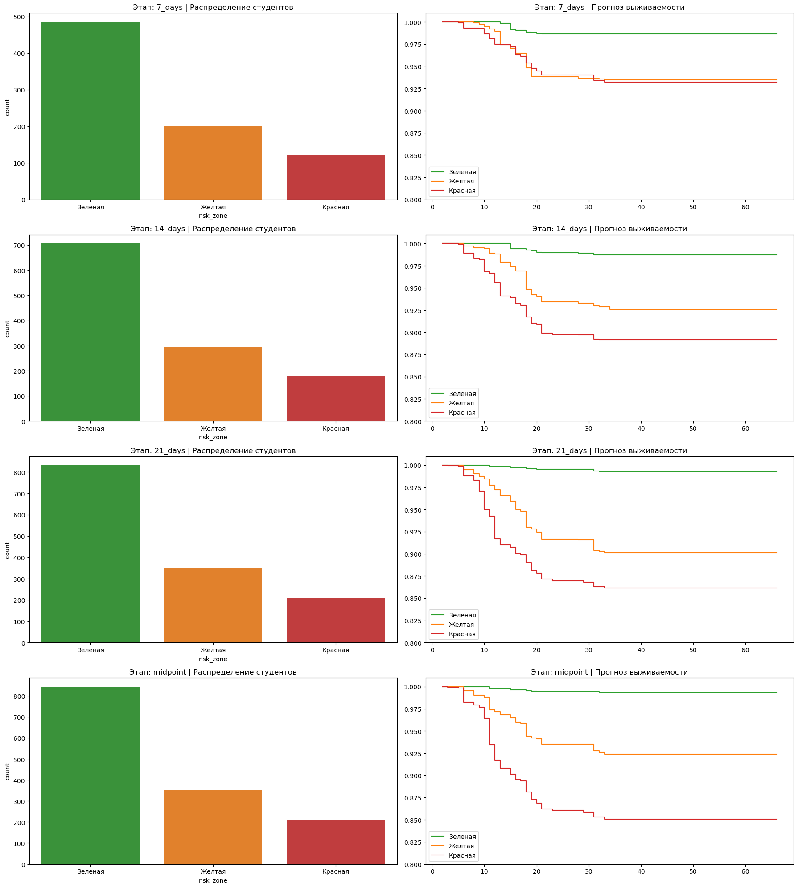

# 1. Краткий итог

Цель кейса: по LMS-данным построить ML-прототип, который заранее выявляет студентов с риском отчисления, объясняет причины риска и помогает тьюторам/методистам выбрать действие до того, как студент фактически перестал учиться.

Главный результат: собран рабочий прототип "Светофор" на уровне `user-course` (одна строка = один студент на конкретном курсе/модуле). "Светофор" классифицирует всех учеников каждого модуля на красную группу (высокий риск), жёлтую (средний риск) и зелёную (низкий риск). На экваторе модуля 3 модель обработала 1407 активных студентов и выделила 211 студентов красной зоны, то есть 15% потока с максимальным приоритетом для тьюторов.

Основной ход работы:

1. Сначала была выбрана гранулярность `user-course` в ноутбуке [granularity_selection.ipynb](https://github.com/mariyakukhtinova-sys/hackaton_mipt_ds_25/blob/master/modules/granularity_selection.ipynb): один студент в одном модуле/курсе. Затем в ноутбуке [heuristics_status_deducing.ipynb](https://github.com/mariyakukhtinova-sys/hackaton_mipt_ds_25/blob/master/modules/heuristics_status_deducing.ipynb) собрана рабочая population-таблица со статусами по M1-M4, фактическим таргетом там, где он есть, и эвристическим таргетом там, где фактического статуса нет.
2. Затем в основном ноутбуке [Tri_sigma_final_research.ipynb](https://github.com/mariyakukhtinova-sys/hackaton_mipt_ds_25/blob/master/Tri_sigma_final_research.ipynb) была собрана базовая витрина признаков: агрегаты из LMS-логов по действиям, ответам, просмотрам, тренингам, доступам и структуре курса. Эта витрина нужна как полная user-course база для анализа и контроля качества признаков.
3. Отдельно была собрана temporal-витрина с отсечением по времени: 33604 строки, по 4 snapshot-среза на каждый `user-course`. Срезы: 7-й, 14-й, 21-й день и `midpoint` (экватор модуля). В каждый снимок попадают только события, произошедшие до этого момента. Это защищает модель от утечки данных, когда в признаки случайно попадает будущая информация.
4. На подготовленных признаках проведен анализ связей: Spearman-корреляции, Mutual Information / MI (взаимная информация для поиска нелинейных связей) и Permutation Importance (оценка важности признака через перемешивание его значений).
5. Для прогноза риска использована Random Survival Forest (RSF): модель ранжирует студентов по риску, строит кривые выживаемости и дает риск-скор для "Светофора". Итоговая метрика RSF: C-index = 0.7662 ± 0.0242. Переносимость проверена через Out-of-Time / OOT-валидацию: обучение на M2, тест на M3, C-index = 0.7636.
6. Для классификационной проверки дополнительно использован CatBoost: на внутренней проверке M1+M2 ROC-AUC = 0.9076, recall риска = 0.83, precision риска = 0.45. Для интерпретации факторов риска использована модель Кокса и Hazard Ratio / HR: коэффициент, который показывает, повышает признак риск отчисления или снижает его.
7. Финальный прототип переведен в бизнес-формат "Светофора": зеленая, желтая и красная зоны риска, приоритеты обработки и рекомендации для тьюторов. На экваторе M3 красная зона составила 211 студентов из 1407; рекомендуемая точка старта активного вмешательства - 14-й день модуля.

# 2. Соответствие критериям оценивания

| Критерий | Что сделано в работе |
|---|---|
| Интерпретируемость паттернов/инсайтов | Построены MI, Permutation Importance и Cox Hazard Ratios. Для каждого ключевого фактора дана бизнес-интерпретация: охват уроков, темп относительно группы, выходной режим, паузы, хаотичный рост действий. |
| Корреляции и гипотезы о причинно-следственных связях | Посчитаны Spearman-корреляции по модулям 1-2, MI для нелинейных связей, HR для направленности влияния. Причинность формулируется как гипотеза, а не как доказанный факт. |
| Соответствие задаче | Есть прогноз риска и выявление групп риска. RSF показывает C-index 0.7636 на Out-of-Time M2 -> M3. Прототип выделяет 211 студентов красной зоны в M3. |
| Техническая завершенность прототипа | Собраны воспроизводимые витрины, есть контроль гранулярности, дедупликация, temporal-срезы без утечки данных, сохранены CSV-артефакты. |
| Наличие прототипа | Реализован "Светофор": зеленая, желтая и красная зоны, приоритеты и действия для кураторов. |
| Наглядность результатов | В отчет включены графики корреляций, MI, важности RSF, ROC-кривых, Hazard Ratios и динамики "Светофора". |

# 3. Постановка задачи

Заказчик: ООО "Цифровое образование" (Цифриум), EdTech-платформа с онлайн-курсами, вебинарами, видео, домашними заданиями, тестами и промежуточной аттестацией.

Бизнес-проблема: низкая доходимость онлайн-курсов. Нужно заранее находить студентов, которые с высокой вероятностью перестанут учиться, и объяснять, какие поведенческие признаки привели к риску.

Конечные пользователи:

- тьюторы: получают список студентов в зоне риска и приоритет действий;
- методисты: видят паттерны, по которым можно менять структуру курса и поддержку;
- аналитики/ML-инженеры: получают витрины и стартовый прототип для дальнейшей модели.

Формальная цель модели: прогнозировать риск неуспешного завершения модуля по LMS-данным, доступным на выбранный момент времени, без использования будущих событий.

# 4. Подготовка таргета

## 4.1. Документационная эвристика

Первый подход к предсказанию статуса M3 строился по таблицам `stats__module_*` и документации к критериям перевода. Идея была максимально простая: взять поля из `stats__module`, перевести документированные критерии в набор бинарных правил и получить статус через эвристику без сложной модели.

На M1 и M2 есть фактический `Статус`, поэтому этот подход можно было проверить до применения к M3. Сравнение показало, что документационная эвристика слишком строгая и заметно расходится с фактическим статусом.

| Модуль | Строк | Accuracy | Precision | Recall | F1 | FP | FN |
|---|---:|---:|---:|---:|---:|---:|---:|
| M1 | 2972 | 0.8567 | 1.0000 | 0.7821 | 0.8777 | 0 | 426 |
| M2 | 1955 | 0.8179 | 1.0000 | 0.8006 | 0.8892 | 0 | 356 |
| M1+M2 | 4927 | 0.8413 | 1.0000 | 0.7909 | 0.8832 | 0 | 782 |

Интерпретация: полный набор документированных критериев не совпадает с фактическим `Статус` в данных. Поэтому использовать такую эвристику как финальный способ разметки M3 нельзя: она систематически строже реальной логики перевода и дает много ошибок относительно фактического статуса на M1-M2.

## 4.2. Улучшенная эвристика

На M1 и M2 были проверены простые правила. Лучшим оказалось правило:

`Сдал ПА` (промежуточную аттестацию) `== Да` или `Балл ПА >= 8` -> `Completed`, иначе `Dropped`.

Качество улучшенной эвристики:

| Модуль | Строк | Accuracy | Precision | Recall | F1 | FP | FN |
|---|---:|---:|---:|---:|---:|---:|---:|
| M1 | 2972 | 0.9976 | 0.9964 | 1.0000 | 0.9982 | 7 | 0 |
| M2 | 1955 | 1.0000 | 1.0000 | 1.0000 | 1.0000 | 0 | 0 |

На M3 это правило дает:

| Статус по эвристике | Количество |
|---|---:|
| Completed | 1707 |
| Dropped | 78 |

Дополнительная проверка траектории: из 78 студентов, помеченных как `Dropped` в M3 по правилу ПА, никто не появляется в M4. Это не доказывает фактический статус M3, но делает эвристику значительно устойчивее, чем полную документационную логику, для которой это правило "отчислен значит не появлялся больше" не работало.

# 5. Гранулярность и витрины

Основной вывод по гранулярности: моделировать нужно уровень `user-course`, а не просто `user`. Один и тот же пользователь проходит разные модули как разные курсы, поэтому схлопывание до `user_id` смешивает разные этапы обучения и искажает признаки.

По событиям LMS собраны две рабочие витрины.

1. `artefacts/user_course_modeling_base.csv`: общая витрина на 8401 строку и 91 колонку. Одна строка соответствует связке `module + user_id + course_id`. Внутри есть статусы, контекст модуля и агрегаты по действиям, ответам, просмотрам, тренингам и доступам. Эта таблица использовалась как базовый слой для анализа и моделей на уровне студента в конкретном модуле.
2. `artefacts/user_course_modeling_snapshots_long.csv`: temporal-витрина на 33604 строки. Единица наблюдения та же, но каждая строка развернута в один из временных срезов: `7_days`, `14_days`, `21_days` или `midpoint`. В каждый срез попадают только события до даты отсечения, поэтому модель не видит будущую активность и не получает утечку данных.

# 6. Корреляции и аналитические инсайты

## 6.1. Spearman-корреляции на M1-M2

Корреляционный анализ считался на сводных таблицах `stats__module_*`, а не на сырых LMS-событиях. В расчет брались только M1 и M2, потому что только там есть фактический `Статус`. Использован Spearman, так как признаки смешанные: бинарные и числовые, а зависимость не обязана быть линейной.

Эти связи частично ожидаемы: ПА, обязательные задания и контроль входят в логику перевода. Поэтому для раннего прогноза такие итоговые признаки нельзя использовать как признаки модели, если они еще не были известны на момент прогноза. Их ценность в другом: они показывают, что фактический `Статус` в данных сильнее всего связан с прохождением ПА и практическими критериями, а не с демографией или техническими ID.

Отдельно интересно, что `pa_score` почти не связан с прохождением курса. Это объясняется структурой данных: на всю выборку есть ровно 1 пользователь, который сдавал ПА, но не набрал нужное число баллов. Остальные отчисленные студенты ПА вообще не сдавали. Поэтому сам балл ПА почти ничего не добавляет: важен факт сдачи ПА, а не величина балла среди сдавших.

{width=75%}

## 6.2. Mutual Information

Здесь мы перешли от сводных `stats__module_*` к признакам из сырых событий LMS: кликам, ответам, просмотрам, тренировкам, паузам и динамике активности. На срезе `midpoint` рассчитана Mutual Information по 78 числовым признакам. MI полезна тем, что ловит нелинейные связи и не ограничивается линейной корреляцией.

Ключевые выводы:

- нормированные признаки относительно когорты важнее абсолютных значений;
- сильны сигналы темпа: `Velocity_W2_zscore`, дни с последнего действия, максимум дневных кликов;
- важен охват практики: `answer_tasks_nunique_zscore`;
- важны media-признаки: максимальная доля просмотра и число 80% media-сессий.

Бизнес-интерпретация: риск нужно искать не только по "мало/много сделал", а по отклонению от нормального ритма конкретного курса. Один и тот же абсолютный уровень активности может быть нормой в одной когорте и тревожным сигналом в другой.

{width=85%}

## 6.3. Гипотезы о причинно-следственных механизмах

Ниже именно гипотезы, а не доказанная причинность. Наблюдательные LMS-данные показывают устойчивые ассоциации, но не дают полного контроля за внешними факторами: мотивация, расписание, качество преподавания, сложность конкретной темы, внешняя нагрузка студента.

| Наблюдение | Возможный механизм | Как проверять дальше |
|---|---|---|
| Высокий `LMS_days_since_last_action_zscore` повышает риск | Длинная пауза относительно когорты означает потерю учебного ритма | A/B: мягкий контакт после 3-5 дней аномальной тишины |
| Высокий `LMS_ratio_weekend` повышает риск | Учеба только на выходных похожа на накопление долга и повышает вероятность срыва | Проверить эффект недельных микро-дедлайнов и weekday-напоминаний |
| Высокий `actions_total_zscore` повышает риск | Всплеск кликов может означать не продуктивность, а хаотичный поиск, попытку догнать, проблемы с навигацией | Добавить события "ошибки", "повторные открытия", время между действиями |
| Высокий `SOC_peer_activity_ratio` снижает риск | Студент, идущий в темпе группы, получает больше контекста и меньше копит отставание | Сравнить интервенции для студентов, отстающих от медианы группы |
| Широкий охват уроков снижает риск | Студент движется по программе последовательно и не застревает на узком участке | Добавить карту сложных тем и прогресс по конкретным урокам |

# 7. Модели и метрики

## 7.1. Random Survival Forest и Permutation Importance

Для survival-подхода выбрана Random Survival Forest (RSF). Причины:

- работает с временем до события, а не только с бинарным исходом;
- дает risk score (балл риска) для ранжирования студентов;
- строит кривые выживаемости;
- улавливает нелинейные зависимости между поведением и риском.

Топ-15 признаков RSF:

1. `lesson_activity_user_lessons_nunique` — importance 0.0347. Число уникальных уроков, где была активность студента; показывает ширину охвата курса.
2. `SOC_peer_activity_ratio` — importance 0.0325. Активность студента относительно среднего темпа группы.
3. `LMS_ratio_weekend` — importance 0.0289. Доля активности, пришедшаяся на выходные.
4. `LMS_days_since_last_action_zscore` — importance 0.0213. Насколько пауза с последнего действия выше или ниже типичной паузы в группе.
5. `LMS_days_since_last_action` — importance 0.0180. Число дней с последнего действия студента в LMS.
6. `LMS_weekend_clicks` — importance 0.0163. Число действий в LMS по выходным.
7. `action_count__visit_translation` — importance 0.0145. Число событий посещения трансляций в общем логе действий.
8. `lesson_activity_count__visit_translation` — importance 0.0131. Число событий посещения трансляций в логе активности по урокам.
9. `ANS_one_shot_kills` — importance 0.0114. Число задач, решенных с первой попытки.
10. `LMS_max_daily_clicks_zscore` — importance 0.0102. Насколько максимальное число действий за день отличается от типичного значения в группе.
11. `LMS_burnout_index_zscore` — importance 0.0093. Нормированный индекс перегрузки по паттернам активности.
12. `ANS_winrate_zscore` — importance 0.0074. Насколько доля успешных ответов отличается от типичной доли в группе.
13. `LMS_max_daily_clicks` — importance 0.0072. Максимальное число действий студента за один день.
14. `lesson_activity_count__show_conspect` — importance 0.0067. Число открытий конспекта.
15. `actions_total` — importance 0.0067. Общее число действий студента в LMS на выбранном срезе.

Метрика RSF: C-index = 0.7662 ± 0.0242.

C-index показывает, насколько хорошо survival-модель ранжирует пары студентов по риску: у кого событие отчисления должно наступить раньше. Значение 0.5 соответствует случайному ранжированию. Значение около 0.76 на таких данных означает полезную прогностическую силу.

{width=85%}

## 7.2. Out-of-Time проверка M2 -> M3

Самая важная проверка: модель обучалась на M2 и тестировалась на M3, где таргет был получен улучшенной эвристикой из п. 4.2, потому что фактического статуса M3 в данных нет. Это ближе к реальному использованию, где модель обучена на завершенном потоке и применяется к следующему.

| Показатель | Значение |
|---|---:|
| Train | M2 |
| Test | M3 |
| Обучающая выборка | 1479 студентов |
| Тестовая выборка | 1407 студентов |
| C-index на train M2 | 0.9576 |
| C-index на test M3 | 0.7636 |

Интерпретация: падение с train до test ожидаемо, но итоговый C-index 0.7636 существенно выше случайного уровня. Это означает, что поведенческие признаки переносятся между соседними учебными периодами.

## 7.3. Сравнение классификационных подходов

Для бизнес-порога прототипа дополнительно сравнивались классификационные модели на срезе M3 midpoint:

- модель 1: обучение на M1+M2;
- модель 2: обучение только на M2.

| Модель | AUC на M3 | Accuracy при пороге 0.90 | Recall риска | Precision риска |
|---|---:|---:|---:|---:|
| M1+M2 | 0.7020 | 0.23 | 0.95 | 0.04 |
| Only M2 | 0.7416 | 0.75 | 0.59 | 0.07 |

Вывод: M1+M2 дает слишком много ложных алертов. Для оперативного "Светофора" лучше использовать последний завершенный модуль, потому что он ближе к текущему контексту.

{width=70%}

## 7.4. Внутренняя проверка M1+M2

Внутренняя проверка показывает верхнюю границу качества при случайном разбиении внутри M1+M2 и использовании фактического таргета.

| Показатель | Значение |
|---|---:|
| Размер выборки | 3571 строка |
| Число признаков | 79 |
| Разбиение | 80/20, stratified |
| ROC-AUC | 0.9076 |
| Accuracy | 0.83 |
| Precision риска | 0.45 |
| Recall риска | 0.83 |
| F1 риска | 0.59 |

Эта метрика выше OOT-проверки, потому что train/test ближе по распределению. Поэтому как основную оценку переносимости следует считать OOT C-index, а внутреннюю проверку использовать как оценку потенциала признаков.

{width=70%}

# 8. Интерпретация риска через Cox Hazard Ratios

Random Survival Forest дает сильное ранжирование, но сложен для прямого объяснения. Поэтому дополнительно обучена модель Кокса на отобранных признаках. Она показывает Hazard Ratio: во сколько раз меняется риск при увеличении признака на 1 стандартное отклонение.

Правило чтения:

- HR > 1: признак повышает риск;
- HR < 1: признак снижает риск;
- HR около 1: нейтральный эффект.

{width=80%}

Практический вывод для тьютора:

1. Сначала проверять студентов с высоким `actions_total_zscore`: это может быть академический стресс, попытки догнать курс или проблема с навигацией.
2. Отдельно контролировать студентов, которые учатся почти только на выходных.
3. Быстро возвращать в ритм студентов с растущей паузой с последнего действия.
4. Не вмешиваться избыточно в зеленую зону: широкий охват уроков и темп на уровне группы уже являются сильной защитой.

# 9. Прототип "Светофор"

## 9.1. Логика сегментации

Прототип переводит risk score модели в операционные зоны:

- зеленая зона: 60% студентов с минимальным риском;
- желтая зона: следующие 25%, профилактическое внимание;
- красная зона: верхние 15% риска, приоритетная ручная работа.

Такое квантильное правило удобно для планирования ресурсов: доля красной зоны фиксирована, тьюторы заранее понимают размер очереди.

## 9.2. Результаты на M3, midpoint

В оперативную выборку M3 на экваторе вошло 1407 студентов.

| Зона | Студентов | Доля | Средний risk score | Средняя вероятность активности к 30-му дню | Приоритет |
|---|---:|---:|---:|---:|---|
| Зеленая | 844 | 60.0% | 0.242 | 0.9856 | Низкий |
| Желтая | 352 | 25.0% | 1.605 | 0.9175 | Средний |
| Красная | 211 | 15.0% | 4.184 | 0.8214 | Высокий |

Интерпретация:

- зеленая зона почти не теряет активность по кривой выживаемости;
- желтая зона начинает проседать после 10-го дня и требует профилактики;
- красная зона показывает резкое снижение уже на ранних днях, поэтому это основной список для тьюторов.

Бизнес-эффект: вместо ручной проверки 1407 студентов куратор получает 211 студентов высшего приоритета. Это сокращает фронт первичной ручной работы до 15% потока.

{width=95%}

## 9.3. Рекомендуемые действия

| Зона | Цель | Действие |
|---|---|---|
| Красная | Удержать студента до точки невозврата | Личный контакт, выяснение причины паузы, помощь с навигацией, корректировка учебного плана |
| Желтая | Не допустить перехода в красную зону | Smart nudging, напоминание о прогрессе, подборка материалов, поддерживающий вебинар |
| Зеленая | Не перегружать лишним вниманием | Self-service, стандартные коммуникации, мониторинг без ручного вмешательства |

# 10. Динамический мониторинг

"Светофор" был проверен не только на экваторе, но и на срезах 7, 14 и 21 день.

| Срез | Зеленая | Желтая | Красная | Всего | Средняя P30 зеленой | Средняя P30 желтой | Средняя P30 красной |
|---|---:|---:|---:|---:|---:|---:|---:|
| 7 дней | 485 | 201 | 122 | 808 | 0.9773 | 0.9405 | 0.8745 |
| 14 дней | 706 | 294 | 177 | 1177 | 0.9868 | 0.9530 | 0.8893 |
| 21 день | 833 | 348 | 208 | 1389 | 0.9841 | 0.9184 | 0.8285 |
| midpoint | 844 | 352 | 211 | 1407 | 0.9856 | 0.9175 | 0.8214 |

Главный вывод: деление на зоны уже работает с 7-го дня, но оптимальная точка для активного вмешательства - 14-й день.

Почему 14-й день:

- в мониторинге уже 1177 студентов, это 83% финальной активной midpoint-популяции;
- красная зона уже сформирована: 177 студентов;
- до резкого падения вероятности в красной зоне на 21-й день еще есть около недели;
- нагрузка на тьюторов уже прогнозируема.

{width=95%}

# 11. Что именно считать инсайтами для методистов

## 11.1. Не только низкая активность, но и неправильная активность

Данные показывают, что риск связан не только с отсутствием действий. Аномально высокий всплеск кликов (`actions_total_zscore`) тоже повышает риск. Это может означать:

- студент накопил долг и пытается быстро догнать;
- студент хаотично ищет нужный материал;
- студент часто возвращается к одним и тем же местам;
- интерфейс или тема курса вызывают затруднение.

Методистам стоит смотреть не только на "мало активен", но и на "слишком резко активировался".

## 11.2. Ритм важнее абсолютного числа действий

`SOC_peer_activity_ratio`, z-score признаков и velocity-признаки показывают, что студент оценивается относительно текущей когорты. Это важно: разные группы и модули имеют разные темпы. Универсальный абсолютный порог кликов может быть грубым.

## 11.3. Выходной режим как риск

Высокий `LMS_ratio_weekend` связан с риском. Возможный механизм: студент учится нерегулярно, копит долг и пытается закрыть его за два дня. Для профилактики можно использовать:

- небольшие weekday-напоминания;
- короткие промежуточные цели;
- подсветку недельного прогресса;
- ранний контакт при повторяющемся выходном паттерне.

## 11.4. Широкий охват уроков лучше, чем отдельные попытки

Самый сильный защитный фактор по HR - `lesson_activity_user_lessons_nunique`. Это означает, что успешный студент движется по программе шире и последовательнее. Если студент много кликает, но затрагивает мало уникальных уроков, это отдельный сигнал застревания.

# 12. Ограничения

1. M3 не имеет фактического `Статус`, поэтому часть анализа M3 опирается на эвристику. Она проверена косвенно через отсутствие возврата "Отчисленных" студентов в M4, но это не заменяет фактическую метку.
2. Наблюдательные LMS-данные не доказывают причинность. В отчете причинные связи формулируются как гипотезы для проверки.
3. В модели пока не хватает внешнего контекста: расписание школьника, сложность конкретной темы, качество вебинара, коммуникации тьютора, прошлый опыт студента.
4. Для ранних срезов часть признаков имеет меньше покрытия. Это нормальное свойство temporal-прогноза, но его нужно учитывать при калибровке.
5. Вероятности survival-модели нужно дополнительно калибровать, если использовать их как точные бизнес-вероятности отчисления.

# 13. Рекомендации по развитию

## 13.1. Longitudinal-обучение

Сейчас ключевая модель обучалась на срезе midpoint. Следующий шаг: обучать модель на всех временных точках сразу и добавить `days_passed` как контекст. Это позволит точнее сравнивать риск на 7, 14, 21 день и на экваторе.

Важно: при train/test split, то есть при разбиении на обучение и проверку, нужно группировать по студенту или user-course, чтобы разные snapshot-срезы одного объекта не попали одновременно в train и test.

## 13.2. Калибровка вероятностей

Нужно откалибровать risk score и survival probability, то есть балл риска и вероятность оставаться активным, чтобы вероятность 0.85 означала ожидаемые 85 успешных завершений из 100 похожих студентов. Это упростит планирование ресурсов и оценку эффекта интервенций.

## 13.3. Интерфейс для тьютора

Выгрузка для тьютора должна содержать:

- `user_id`;
- модуль и курс;
- зона риска;
- risk score;
- вероятность активности к 30-му дню;
- топ-3 причины риска для конкретного студента;
- рекомендуемое действие.

Минимальный формат:

| Поле | Зачем нужно |
|---|---|
| `risk_zone` | Приоритет обработки |
| `risk_score` | Сортировка внутри зоны |
| `survival_prob_d30` | Оценка срочности |
| `top_risk_factor_1..3` | Объяснение для тьютора |
| `recommended_action` | Быстрое действие без ручной интерпретации модели |

## 13.4. Внешние признаки

Рекомендуемые источники для обогащения:

- сложность темы и урока;
- даты дедлайнов;
- факт коммуникации тьютора;
- посещаемость вне LMS;
- история предыдущих модулей и прошлых попыток;
- технические проблемы: ошибки запуска видео, зависания, повторные открытия одного материала.

# 14. Артефакты работы

| Артефакт | Путь | Назначение |
|---|---|---|
| Основной ноутбук | [Tri_sigma_final_research.ipynb](https://github.com/mariyakukhtinova-sys/hackaton_mipt_ds_25/blob/master/Tri_sigma_final_research.ipynb) | Сбор витрин, признаки, модели, метрики, "Светофор" |
| Гранулярность | [modules/granularity_selection.ipynb](https://github.com/mariyakukhtinova-sys/hackaton_mipt_ds_25/blob/master/modules/granularity_selection.ipynb) | Доказательство выбора уровня `user-course` |
| Эвристика статуса | [modules/heuristics_status_deducing.ipynb](https://github.com/mariyakukhtinova-sys/hackaton_mipt_ds_25/blob/master/modules/heuristics_status_deducing.ipynb) | Очистка `stats__module_*`, выбор приближенного таргета |
| Единый статусный датасет | [modules/status_modules_complete.csv](https://github.com/mariyakukhtinova-sys/hackaton_mipt_ds_25/blob/master/modules/status_modules_complete.csv) | Population-таблица по 4 модулям |
| Базовая витрина | [artefacts/user_course_modeling_base.csv](https://github.com/mariyakukhtinova-sys/hackaton_mipt_ds_25/blob/master/artefacts/user_course_modeling_base.csv) | Полная user-course витрина |
| Temporal-витрина | [artefacts/user_course_modeling_snapshots_long.csv](https://github.com/mariyakukhtinova-sys/hackaton_mipt_ds_25/blob/master/artefacts/user_course_modeling_snapshots_long.csv) | Snapshot-витрина 7/14/21/midpoint |
| Скриншоты отчета | [report_assets/](https://github.com/mariyakukhtinova-sys/hackaton_mipt_ds_25/tree/master/report_assets) | Графики для Markdown/PDF |

# 15. Финальный вывод

Работа закрывает поставленную задачу: построен технически завершенный прототип прогнозирования риска на LMS-данных, собраны витрины, проведены корреляционный и нелинейный анализы, отобраны интерпретируемые признаки, рассчитаны метрики и сформирован бизнес-прототип "Светофор".

Основная ценность для заказчика: модель не только ранжирует студентов по риску, но и объясняет, почему студент попал в риск. Это переводит ML-результат из "черного списка вероятностей" в рабочий инструмент тьютора: кого обработать первым, когда начать контакт и какой вопрос задать студенту.
